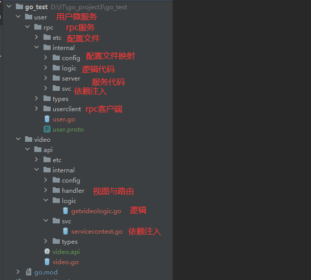

[TOC]

# Gin基础使用

## Gin路由

### 普通路由

```go
r.GET("/index", func(c *gin.Context) {...})
r.GET("/login", func(c *gin.Context) {...})
r.POST("/login", func(c *gin.Context) {...})
```

此外，还有一个可以匹配所有请求方法的`Any`方法如下：

```go
r.Any("/test", func(c *gin.Context) {...})
```

为没有配置处理函数的路由添加处理程序，默认情况下它返回404代码，下面的代码为没有匹配到路由的请求都返回`views/404.html`页面。

```go
r.NoRoute(func(c *gin.Context) {
    c.HTML(http.StatusNotFound, "views/404.html", nil)
})
```

### 路由组

我们可以将拥有共同URL前缀的路由划分为一个路由组。习惯性一对`{}`包裹同组的路由，这只是为了看着清晰，你用不用`{}`包裹功能上没什么区别。

```go
func main() {
    r := gin.Default()
    userGroup := r.Group("/user")
    {
        userGroup.GET("/index", func(c *gin.Context) {...})
        userGroup.GET("/login", func(c *gin.Context) {...})
        userGroup.POST("/login", func(c *gin.Context) {...})

    }
    shopGroup := r.Group("/shop")
    {
        shopGroup.GET("/index", func(c *gin.Context) {...})
        shopGroup.GET("/cart", func(c *gin.Context) {...})
        shopGroup.POST("/checkout", func(c *gin.Context) {...})
    }
    r.Run()
}
```

路由组也是支持嵌套的，例如：

```go
shopGroup := r.Group("/shop")
    {
        shopGroup.GET("/index", func(c *gin.Context) {...})
        shopGroup.GET("/cart", func(c *gin.Context) {...})
        shopGroup.POST("/checkout", func(c *gin.Context) {...})
        // 嵌套路由组
        xx := shopGroup.Group("xx")
        xx.GET("/oo", func(c *gin.Context) {...})
    }
```

通常我们将路由分组用在划分业务逻辑或划分API版本时。

## 重定向

- **HTTP重定向：**

HTTP 重定向很容易。 内部、外部重定向均支持。

```go
r.GET("/test", func(c *gin.Context) {
    c.Redirect(http.StatusMovedPermanently, "http://www.sogo.com/")
})
```

- **路由重定向：**

路由重定向，使用`HandleContext`：

```go
r.GET("/test", func(c *gin.Context) {
    // 指定重定向的URL
    c.Request.URL.Path = "/test2"
    r.HandleContext(c)
})
r.GET("/test2", func(c *gin.Context) {
    c.JSON(http.StatusOK, gin.H{"hello": "world"})
})
```

Gin框架允许开发者在处理请求的过程中，加入用户自己的钩子（Hook）函数。这个钩子函数就叫中间件，中间件适合处理一些公共的业务逻辑，比如登录认证、权限校验、数据分页、记录日志、耗时统计等。

## 参数解析

### querystring

/user/search?username=小王子&address=沙河

```go
func main() {
    //Default返回一个默认的路由引擎
    r := gin.Default()
    r.GET("/user/search", func(c *gin.Context) {
        username := c.DefaultQuery("username", "小王子")
        //username := c.Query("username")
        address := c.Query("address")
        //输出json结果给调用方
        c.JSON(http.StatusOK, gin.H{
            "message":  "ok",
            "username": username,
            "address":  address,
        })
    })
    r.Run()
}
```

### form

/user/search

```go
func main() {
    //Default返回一个默认的路由引擎
    r := gin.Default()
    r.POST("/user/search", func(c *gin.Context) {
        // DefaultPostForm取不到值时会返回指定的默认值
        //username := c.DefaultPostForm("username", "小王子")
        username := c.PostForm("username")
        address := c.PostForm("address")
        //输出json结果给调用方
        c.JSON(http.StatusOK, gin.H{
            "message":  "ok",
            "username": username,
            "address":  address,
        })
    })
    r.Run(":8080")
}
```

### request body

/json

```go
r.POST("/json", func(c *gin.Context) {
    // 注意：下面为了举例子方便，暂时忽略了错误处理
    b, _ := c.GetRawData()  // 从c.Request.Body读取请求数据
    // 定义map或结构体
    var m map[string]interface{}
    // 反序列化
    _ = json.Unmarshal(b, &m)

    c.JSON(http.StatusOK, m)
})
```

### path

/user/search/小王子/沙河

```go
func main() {
    //Default返回一个默认的路由引擎
    r := gin.Default()
    r.GET("/user/search/:username/:address", func(c *gin.Context) {
        username := c.Param("username")
        address := c.Param("address")
        //输出json结果给调用方
        c.JSON(http.StatusOK, gin.H{
            "message":  "ok",
            "username": username,
            "address":  address,
        })
    })

    r.Run(":8080")
}
```

### 自动参数绑定

为了能够更方便的获取请求相关参数，提高开发效率，我们可以基于请求的`Content-Type`识别请求数据类型并利用反射机制自动提取请求中`QueryString`、`form表单`、`JSON`、`XML`等参数到结构体中。 下面的示例代码演示了`.ShouldBind()`强大的功能，它能够基于请求自动提取`JSON`、`form表单`和`QueryString`类型的数据，并把值绑定到指定的结构体对象。

`ShouldBind`会按照下面的顺序解析请求中的数据完成绑定：

1. 如果是 `GET` 请求，只使用 `Form` 绑定引擎（`query`）。
2. 如果是 `POST` 请求，首先检查 `content-type` 是否为 `JSON` 或 `XML`，然后再使用 `Form`（`form-data`）。

```go
// Binding from JSON
type Login struct {
    User     string `form:"user" json:"user" binding:"required"`
    Password string `form:"password" json:"password" binding:"required"`
}

func main() {
    router := gin.Default()

    // 绑定JSON的示例 ({"user": "q1mi", "password": "123456"})
    router.POST("/loginJSON", func(c *gin.Context) {
        var login Login

        if err := c.ShouldBind(&login); err == nil {
            fmt.Printf("login info:%#v\n", login)
            c.JSON(http.StatusOK, gin.H{
                "user":     login.User,
                "password": login.Password,
            })
        } else {
            c.JSON(http.StatusBadRequest, gin.H{"error": err.Error()})
        }
    })
    // Listen and serve on 0.0.0.0:8080
    router.Run(":8080")
}
```

## 文件上传

### 单文件

```html
<form action="/upload" method="post" enctype="multipart/form-data">
    <input type="file" name="f1">
    <input type="submit" value="上传">
</form>
```

```go
func main() {
    router := gin.Default()
    // 处理multipart forms提交文件时默认的内存限制是32 MiB
    // 可以通过下面的方式修改
    // router.MaxMultipartMemory = 8 << 20  // 8 MiB
    router.POST("/upload", func(c *gin.Context) {
        // 单个文件
        file, err := c.FormFile("f1")
        if err != nil {
            c.JSON(http.StatusInternalServerError, gin.H{
                "message": err.Error(),
            })
            return
        }

        log.Println(file.Filename)
        dst := fmt.Sprintf("C:/tmp/%s", file.Filename)
        // 上传文件到指定的目录
        c.SaveUploadedFile(file, dst)
        c.JSON(http.StatusOK, gin.H{
            "message": fmt.Sprintf("'%s' uploaded!", file.Filename),
        })
    })
    router.Run()
}
```

### 多文件

```go
func main() {
    router := gin.Default()
    // 处理multipart forms提交文件时默认的内存限制是32 MiB
    // 可以通过下面的方式修改
    // router.MaxMultipartMemory = 8 << 20  // 8 MiB
    router.POST("/upload", func(c *gin.Context) {
        // Multipart form
        form, _ := c.MultipartForm()
        files := form.File["file"]

        for index, file := range files {
            log.Println(file.Filename)
            dst := fmt.Sprintf("C:/tmp/%s_%d", file.Filename, index)
            // 上传文件到指定的目录
            c.SaveUploadedFile(file, dst)
        }
        c.JSON(http.StatusOK, gin.H{
            "message": fmt.Sprintf("%d files uploaded!", len(files)),
        })
    })
    router.Run()
}
```

## 中间件

中间件就是钩子函数（我觉得这也是一个面向切面编程？？）

### 定义中间件

Gin中的中间件必须是一个`gin.HandlerFunc`类型。

#### 记录接口耗时的中间件

例如我们像下面的代码一样定义一个统计请求耗时的中间件。

```go
// StatCost 是一个统计耗时请求耗时的中间件
func StatCost() gin.HandlerFunc {
    return func(c *gin.Context) {
        start := time.Now()
        c.Set("name", "小王子") // 可以通过c.Set在请求上下文中设置值，后续的处理函数能够取到该值
        // 调用该请求的剩余处理程序
        c.Next()
        // 不调用该请求的剩余处理程序
        // c.Abort()
        // 计算耗时
        cost := time.Since(start)
        log.Println(cost)
    }
}
```

#### 记录响应体的中间件

我们有时候可能会想要记录下某些情况下返回给客户端的响应数据，这个时候就可以编写一个中间件来搞定。

```go
type bodyLogWriter struct {
    gin.ResponseWriter               // 嵌入gin框架ResponseWriter
    body               *bytes.Buffer // 我们记录用的response
}

// Write 写入响应体数据
func (w bodyLogWriter) Write(b []byte) (int, error) {
    w.body.Write(b)                  // 我们记录一份
    return w.ResponseWriter.Write(b) // 真正写入响应
}

// ginBodyLogMiddleware 一个记录返回给客户端响应体的中间件
// https://stackoverflow.com/questions/38501325/how-to-log-response-body-in-gin
func ginBodyLogMiddleware(c *gin.Context) {
    blw := &bodyLogWriter{body: bytes.NewBuffer([]byte{}), ResponseWriter: c.Writer}
    c.Writer = blw // 使用我们自定义的类型替换默认的

    c.Next() // 执行业务逻辑

    fmt.Println("Response body: " + blw.body.String()) // 事后按需记录返回的响应
}
```

#### 跨域中间件cors

推荐使用社区的https://github.com/gin-contrib/cors 库，一行代码解决前后端分离架构下的跨域问题。

**注意：** 该中间件需要注册在业务处理函数前面。

这个库支持各种常用的配置项，具体使用方法如下。

```go
package main

import (
  "time"

  "github.com/gin-contrib/cors"
  "github.com/gin-gonic/gin"
)

func main() {
  router := gin.Default()
  // CORS for https://foo.com and https://github.com origins, allowing:
  // - PUT and PATCH methods
  // - Origin header
  // - Credentials share
  // - Preflight requests cached for 12 hours
  router.Use(cors.New(cors.Config{
    AllowOrigins:     []string{"https://foo.com"},  // 允许跨域发来请求的网站
    AllowMethods:     []string{"GET", "POST", "PUT", "DELETE",  "OPTIONS"},  // 允许的请求方法
    AllowHeaders:     []string{"Origin", "Authorization", "Content-Type"},
    ExposeHeaders:    []string{"Content-Length"},
    AllowCredentials: true,
    AllowOriginFunc: func(origin string) bool {  // 自定义过滤源站的方法
      return origin == "https://github.com"
    },
    MaxAge: 12 * time.Hour,
  }))
  router.Run()
}
```

当然你可以简单的像下面的示例代码那样使用默认配置，允许所有的跨域请求。

```go
func main() {
  router := gin.Default()
  // same as
  // config := cors.DefaultConfig()
  // config.AllowAllOrigins = true
  // router.Use(cors.New(config))
  router.Use(cors.Default())
  router.Run()
}
```

### 注册中间件

在gin框架中，我们可以为每个路由添加任意数量的中间件。

#### 为全局路由注册

```go
func main() {
    // 新建一个没有任何默认中间件的路由
    r := gin.New()
    // 注册一个全局中间件
    r.Use(StatCost())

    r.GET("/test", func(c *gin.Context) {
        name := c.MustGet("name").(string) // 从上下文取值
        log.Println(name)
        c.JSON(http.StatusOK, gin.H{
            "message": "Hello world!",
        })
    })
    r.Run()
}
```

#### 为某个路由单独注册

```go
// 给/test2路由单独注册中间件（可注册多个）
    r.GET("/test2", StatCost(), func(c *gin.Context) {
        name := c.MustGet("name").(string) // 从上下文取值
        log.Println(name)
        c.JSON(http.StatusOK, gin.H{
            "message": "Hello world!",
        })
    })
```

#### 为路由组注册中间件

为路由组注册中间件有以下两种写法。

写法1：

```go
shopGroup := r.Group("/shop", StatCost())
{
    shopGroup.GET("/index", func(c *gin.Context) {...})
    ...
}
```

写法2：

```go
shopGroup := r.Group("/shop")
shopGroup.Use(StatCost())
{
    shopGroup.GET("/index", func(c *gin.Context) {...})
    ...
}
```

### 中间件注意事项

#### gin默认中间件

`gin.Default()`默认使用了`Logger`和`Recovery`中间件，其中：

- `Logger`中间件将日志写入`gin.DefaultWriter`，即使配置了`GIN_MODE=release`。
- `Recovery`中间件会recover任何`panic`。如果有panic的话，会写入500响应码。

如果不想使用上面两个默认的中间件，可以使用`gin.New()`新建一个没有任何默认中间件的路由。

#### gin中间件中使用goroutine

当在中间件或`handler`中启动新的`goroutine`时，**不能使用**原始的上下文（c *gin.Context），必须使用其只读副本（`c.Copy()`）。

## 运行多个服务

```go
package main

import (
    "log"
    "net/http"
    "time"

    "github.com/gin-gonic/gin"
    "golang.org/x/sync/errgroup"
)

var (
    g errgroup.Group
)

func router01() http.Handler {
    e := gin.New()
    e.Use(gin.Recovery())
    e.GET("/", func(c *gin.Context) {
        c.JSON(
            http.StatusOK,
            gin.H{
                "code":  http.StatusOK,
                "error": "Welcome server 01",
            },
        )
    })

    return e
}

func router02() http.Handler {
    e := gin.New()
    e.Use(gin.Recovery())
    e.GET("/", func(c *gin.Context) {
        c.JSON(
            http.StatusOK,
            gin.H{
                "code":  http.StatusOK,
                "error": "Welcome server 02",
            },
        )
    })

    return e
}

func main() {
    server01 := &http.Server{
        Addr:         ":8080",
        Handler:      router01(),
        ReadTimeout:  5 * time.Second,
        WriteTimeout: 10 * time.Second,
    }

    server02 := &http.Server{
        Addr:         ":8081",
        Handler:      router02(),
        ReadTimeout:  5 * time.Second,
        WriteTimeout: 10 * time.Second,
    }
   // 借助errgroup.Group或者自行开启两个goroutine分别启动两个服务
    g.Go(func() error {
        return server01.ListenAndServe()
    })

    g.Go(func() error {
        return server02.ListenAndServe()
    })

    if err := g.Wait(); err != nil {
        log.Fatal(err)
    }
}
```

## Reference Links

> - https://www.liwenzhou.com/posts/Go/gin/

# Gorm基础使用

## 模型定义

模型是使用普通结构体定义的。 这些结构体可以包含具有基本Go类型、指针或这些类型的别名，甚至是自定义类型（只需要实现 `database/sql` 包中的[Scanner](https://pkg.go.dev/database/sql/?tab=doc#Scanner)和[Valuer](https://pkg.go.dev/database/sql/driver#Valuer)接口）。

### 字段标签

| 标签名                    | 说明                                                                                                                                                                                                                                       |
|:---------------------- |:---------------------------------------------------------------------------------------------------------------------------------------------------------------------------------------------------------------------------------------- |
| column                 | 指定 db 列名                                                                                                                                                                                                                                 |
| type                   | 列数据类型，推荐使用兼容性好的通用类型，例如：所有数据库都支持 bool、int、uint、float、string、time、bytes 并且可以和其他标签一起使用，例如：`not null`、`size`, `autoIncrement`… 像 `varbinary(8)` 这样指定数据库数据类型也是支持的。在使用指定数据库数据类型时，它需要是完整的数据库数据类型，如：`MEDIUMINT UNSIGNED not NULL AUTO_INCREMENT` |
| serializer             | 指定将数据序列化或反序列化到数据库中的序列化器, 例如: `serializer:json/gob/unixtime`                                                                                                                                                                              |
| size                   | 定义列数据类型的大小或长度，例如 `size: 256`                                                                                                                                                                                                             |
| primaryKey             | 将列定义为主键                                                                                                                                                                                                                                  |
| unique                 | 将列定义为唯一键                                                                                                                                                                                                                                 |
| default                | 定义列的默认值                                                                                                                                                                                                                                  |
| precision              | 指定列的精度                                                                                                                                                                                                                                   |
| scale                  | 指定列大小                                                                                                                                                                                                                                    |
| not null               | 指定列为 NOT NULL                                                                                                                                                                                                                            |
| autoIncrement          | 指定列为自动增长                                                                                                                                                                                                                                 |
| autoIncrementIncrement | 自动步长，控制连续记录之间的间隔                                                                                                                                                                                                                         |
| embedded               | 嵌套字段                                                                                                                                                                                                                                     |
| embeddedPrefix         | 嵌入字段的列名前缀                                                                                                                                                                                                                                |
| autoCreateTime         | 创建时追踪当前时间，对于 `int` 字段，它会追踪时间戳秒数，您可以使用 `nano`/`milli` 来追踪纳秒、毫秒时间戳，例如：`autoCreateTime:nano`                                                                                                                                                |
| autoUpdateTime         | 创建/更新时追踪当前时间，对于 `int` 字段，它会追踪时间戳秒数，您可以使用 `nano`/`milli` 来追踪纳秒、毫秒时间戳，例如：`autoUpdateTime:milli`                                                                                                                                            |
| index                  | 根据参数创建索引，多个字段使用相同的名称则创建复合索引，查看 [索引](https://gorm.io/zh_CN/docs/indexes.html) 获取详情                                                                                                                                                        |
| uniqueIndex            | 与 `index` 相同，但创建的是唯一索引                                                                                                                                                                                                                   |
| check                  | 创建检查约束，例如 `check:age > 13`，查看 [约束](https://gorm.io/zh_CN/docs/constraints.html) 获取详情                                                                                                                                                     |
| <-                     | 设置字段写入的权限， `<-:create` 只创建、`<-:update` 只更新、`<-:false` 无写入权限、`<-` 创建和更新权限                                                                                                                                                                 |
| ->                     | 设置字段读的权限，`->:false` 无读权限                                                                                                                                                                                                                 |
| -                      | 忽略该字段，`-` 表示无读写，`-:migration` 表示无迁移权限，`-:all` 表示无读写迁移权限                                                                                                                                                                                  |
| comment                | 迁移时为字段添加注释                                                                                                                                                                                                                               |

### gorm.Model

GORM提供了一个预定义的结构体，名为`gorm.Model`，其中包含常用字段：

```go
// gorm.Model 定义
type Model struct {
    ID        uint `gorm:"primary_key"`
    CreatedAt time.Time
    UpdatedAt time.Time
    DeletedAt *time.Time
}
```

**包含的字段**：

- `ID` ：每个记录的唯一标识符（主键）。
- `CreatedAt` ：在创建记录时自动设置为当前时间。
- `UpdatedAt`：每当记录更新时，自动更新为当前时间。
- `DeletedAt`：用于软删除（将记录标记为已删除，而实际上并未从数据库中删除）。

### 约定和字段权限控制

约定：

1. **主键**：GORM 使用一个名为`ID` 的字段作为每个模型的默认主键。
2. **表名**：默认情况下，GORM 将结构体名称转换为 `snake_case` 并为表名加上复数形式。 例如，一个 `User` 结构体在数据库中的表名变为 `users` 。
3. **列名**：GORM 自动将结构体字段名称转换为 `snake_case` 作为数据库中的列名。
4. **时间戳字段**：GORM使用字段 `CreatedAt` 和 `UpdatedAt` 来自动跟踪记录的创建和更新时间。

字段权限控制：

可导出的字段在使用 GORM 进行 CRUD 时拥有全部的权限，此外，GORM 允许您用标签控制字段级别的权限。这样您就可以让一个字段的权限是只读、只写、只创建、只更新或者被忽略

> **注意：** 使用 GORM Migrator 创建表时，不会创建被忽略的字段

```go
type User struct {
    Name string `gorm:"<-:create"` // 允许读和创建
    Name string `gorm:"<-:update"` // 允许读和更新
    Name string `gorm:"<-"`        // 允许读和写（创建和更新）
    Name string `gorm:"<-:false"`  // 允许读，禁止写
    Name string `gorm:"->"`        // 只读（除非有自定义配置，否则禁止写）
    Name string `gorm:"->;<-:create"` // 允许读和写
    Name string `gorm:"->:false;<-:create"` // 仅创建（禁止从 db 读）
    Name string `gorm:"-"`  // 通过 struct 读写会忽略该字段
    Name string `gorm:"-:all"`        // 通过 struct 读写、迁移会忽略该字段
    Name string `gorm:"-:migration"`  // 通过 struct 迁移会忽略该字段
}
```

### 结构体嵌入

- 对于匿名字段，GORM 会将其字段包含在父结构体中
- 对于正常的结构体字段，你也可以通过标签 `embedded` 将其嵌入

```go
type Author struct {
    Name  string
    Email string
}

type Blog struct {
    ID      int
    Author  Author `gorm:"embedded"`
    Upvotes int32
}

// 等效于
type Blog struct {
    ID    int64
    Name  string
    Email string
    Upvotes  int32
}
```

- 并且，您可以使用标签 `embeddedPrefix` 来为 db 中的字段名添加前缀，例如：

```go
type Blog struct {
    ID      int
    Author  Author `gorm:"embedded;embeddedPrefix:author_"`
    Upvotes int32
}
// 等效于
type Blog struct {
    ID          int64
    AuthorName string
    AuthorEmail string
    Upvotes     int32
}
```

## Reference Links

> - https://gorm.io/zh_CN/docs/
> - https://www.liwenzhou.com/posts/Go/gorm/

# go-zero基础使用

## 最简单的go-zero demo

### 步骤 与 目录结构

1. 编写用户微服务的rpc服务的proto文件
2. 生成代码
3. 添加自己的逻辑
4. 编写视频微服务的api服务的api文件
5. 生成代码
6. 完善依赖，配置（api中添加rpc配置）
7. 添加自己的逻辑



### user rpc

Project/user/rpc/user.proto

```protobuf
syntax = "proto3";

package user;

option go_package = "./user";

message IdRequest {
  string id = 1;
}

message UserResponse {
  // 用户id
  string id = 1;
  // 用户名称
  string name = 2;
  // 用户性别
  bool gender = 3;
}

service User {
  rpc getUser(IdRequest) returns(UserResponse);
}
```

生成代码：Project/user/rpc/

```sh
goctl rpc protoc ./user.proto --go_out=./types --go-grpc_out=./types --zrpc_out=./
```

生成的代码里 yaml 配置文件中自动填写了 etcd 的配置信息

在 `user/rpc/internal/logic/getuserlogic.go` 填写必要的逻辑：

```go
func (l *GetUserLogic) GetUser(in *user.IdRequest) (*user.UserResponse, error) {
    // todo: add your logic here and delete this line

    return &user.UserResponse{Id: in.Id, Name: "zero", Gender: true}, nil
}
```

### video api

Project/video/api/video.api

```go
type (
    VideoReq {
        Id string `path:"id"`
    }
    VideoRes {
        Id   string `json:"id"`
        Name string `json:"name"`
    }
)

service video {
    @handler getVideo
    get /api/videos/:id (VideoReq) returns (VideoRes)
}
```

生成代码：Project/video/api/

```sh
goctl api go -api ./video.api -dir ./
```

### api 调用 user rpc

- 添加 user rpc 配置：

Project/video/api/internal/config/config.go：

添加 `UserRpc zrpc.RpcClientConf`

```go
type Config struct {
    rest.RestConf
    UserRpc zrpc.RpcClientConf
}
```

- 完善服务依赖：

Project/video/api/internal/svc/servicecontext.go：

在 ServiceContext 中添加 ` UserRpc userclient.User`，在 NewServicecontext 中添加  `UserRpc: userclient.NewUser(zrpc.MustNewClient(c.UserRpc)),`

```go
type ServiceContext struct {
    Config  config.Config
    UserRpc userclient.User
}

func NewServiceContext(c config.Config) *ServiceContext {
    return &ServiceContext{
       Config:  c,
       UserRpc: userclient.NewUser(zrpc.MustNewClient(c.UserRpc)),
    }
}
```

- 添加client rpc yaml配置：

Project/video/api/etc/video.yaml：

```yaml
Name: video
Host: 0.0.0.0
Port: 8888
UserRpc:
  Etcd:
    Hosts:
      - 127.0.0.1:2379
    Key: user.rpc
```

- 完善调用 user rpc 逻辑：

Project/video/api/internal/logic/getvideologic.go：

通过 `l.svcCtx.UserRpc` 调用 RPC 方法

```go
func (l *GetVideoLogic) GetVideo(req *types.VideoReq) (resp *types.VideoRes, err error) {
    // todo: add your logic here and delete this line
    user1, err := l.svcCtx.UserRpc.GetUser(l.ctx, &user.IdRequest{Id: "1"})
    if err != nil {
        return nil, err
    }
    return &types.VideoRes{
        Id:   req.Id,
        Name: user1.Name,
    }, nil
}
```

启动项目：先启动 user rpc，再启动 video api

```sh
cd <Project>
go run user/rpc/user.go -f user/rpc/etc/user.yaml
go run video/api/video.go -f video/api/etc/video.yaml

# 测试
curl 127.0.0.1:8888/api/videos/1
```

## API 定义

API 语法规范：https://go-zero.dev/docs/tutorials

### 类型声明

1. 类型声明必须以 `type` 开头
2. 不需要声明 `struct`关键字
3. 不支持嵌套结构体声明（不能在一个结构体中声明另一个字结构体，可以提前声明一个结构体后嵌套调用）
4. 不支持别名
5. 暂时不支持泛型、弱类型，如 `any` 类型

### 路由前缀

通过 @server 语法块的`prefix` 关键字

```go
@server (
    prefix: /v1
)
service user-api {
    @handler usersv1
    get /users returns ([]UserV1)
}

@server (
    prefix: /v2
)
service user-api {
    @handler usersv2
    get /users returns ([]UserV2)
}
```

### 服务分组

通过 @server 语法块的`group` 关键字

```go
@server (
    prefix: /v1
    group:  user
)
service user-api {
    @handler UserLogin
    post /user/login (UserLoginReq) returns (UserLoginResp)
}

@server (
    prefix: /v1
    group:  role
)
service user-api {
    @handler UserRoleList
    get /user/role/list returns ([]UserRoleResp)
}

@server (
    prefix: /v1
    group:  class
)
service user-api {
    @handler UserClassList
    get /user/class/list returns ([]UserClassResp)
}
```

### 签名开关

通过 @server 语法块的`signature` 关键字

```go
@server (
    signature: true // 通过 signature 关键字开启签名功能
)
service sign-api {
    @handler SignDemo
    post /sign/demo (SignDemoReq) returns (SignDemoResp)
}
```

### 开启JWT认证

通过 @server 语法块的`jwt` 关键字

```go
@server (
    jwt: Auth // 开启 jwt 认证
)
service user-api {
    @handler userInfo
    post /user/info (UserInfoReq) returns (UserInfoResp)
}
```

该 jwt 认证仅对其对应的路由有用

修改配置文件：

```yaml
Name: users
Host: 0.0.0.0
Port: 8888
Auth:
  AccessSecret: cwaiugebvaihdfw
  AccessExpire: 3600 # 秒
```

### 路由规则

在 api 描述语言中，路由需要满足如下规则

1. 路由必须以 `/` 开头
2. 路由节点必须以 `/` 分隔
3. 路由节点中可以包含 `:`，但是 `:` 必须是路由节点的第一个字符，`:` 后面的节点值必须要在结请求体中有 `path` tag 声明，用于接收路由参数，详细规则可参考 [路由参数](https://go-zero.dev/docs/tutorials/api/parameter)。
4. 路由节点可以包含字母、数字(`goctl 1.5.1` 支持，可参考[ 新版 API 解析器使用](https://go-zero.dev/docs/tutorials/api/faq#1-怎么体验新的-api-特性))、下划线、中划线

```go
syntax = "v1"

type DemoPath3Req {
    Id int64 `path:"id"`
}

type DemoPath4Req {
    Id   int64  `path:"id"`
    Name string `path:"name"`
}

type DemoPath5Req {
    Id   int64  `path:"id"`
    Name string `path:"name"`
    Age  int    `path:"age"`
}

type DemoReq {}

type DemoResp {}

service Demo {
    // 示例路由 /foo
    @handler demoPath1
    get /foo (DemoReq) returns (DemoResp)

    // 示例路由 /foo/bar
    @handler demoPath2
    get /foo/bar (DemoReq) returns (DemoResp)

    // 示例路由 /foo/bar/:id，其中 id 为请求体中的字段
    @handler demoPath3
    get /foo/bar/:id (DemoPath3Req) returns (DemoResp)

    // 示例路由 /foo/bar/:id/:name，其中 id，name 为请求体中的字段
    @handler demoPath4
    get /foo/bar/:id/:name (DemoPath4Req) returns (DemoResp)

    // 示例路由 /foo/bar/:id/:name/:age，其中 id，name，age 为请求体中的字段
    @handler demoPath5
    get /foo/bar/:id/:name/:age (DemoPath5Req) returns (DemoResp)

    // 示例路由 /foo/bar/baz-qux
    @handler demoPath6
    get /foo/bar/baz-qux (DemoReq) returns (DemoResp)

    // 示例路由 /foo/bar_baz/123(goctl 1.5.1 支持)
    @handler demoPath7
    get /foo/bar_baz/123 (DemoReq) returns (DemoResp)
}
```

### 参数规则

参数接收规则：

| 接收规则   | 说明                                                                                                | 生效范围    | 接收tag示例                 | 请求示例                                                |
| ------ | ------------------------------------------------------------------------------------------------- | ------- | ----------------------- | --------------------------------------------------- |
| json   | json 序列化                                                                                          | 请求体&响应体 | json:"foo"              | {"key":"vulue"}                                     |
| path   | 路由参数                                                                                              | 请求体     | path:"id"               | /foo/:id                                            |
| form   | post 请求的表单(支持 content-type 为 `form-data` 和 `x-www-form-urlencoded`) 参数请求接收标识，get 请求的 query 参数接收标识 | 请求体     | form:"name"             | GET /search?key=vulue                               |
| header | http 请求体接收标识                                                                                      | 请求体     | header:"Content-Length" | origin: [https://go-zero.dev](https://go-zero.dev/) |

参数校验规则：

参数校验的规则仅对 **请求体** 有效，参数校验的规则写在 tag value中，目前 go-zero 支持的参数校验规则如下：

| 校验规则     | 说明                              | 示例                           |
| -------- | ------------------------------- | ---------------------------- |
| optional | 当前字段是可选参数，允许为零值(zero value)     | `json:"foo,optional"`        |
| options  | 当前参数仅可接收的枚举值                    | `json:"gender,options=foo    |
| default  | 当前参数默认值                         | `json:"gender,default=male"` |
| range    | 当前参数数值有效范围，仅对数值有效，写法规则详情见下文温馨提示 | `json:"age,range=[0:120]"`   |

range 的括号可开可闭

### 中间件声明

通过 @server 语法块的`middleware` 关键字

```go
@server(
    // 通过 middileware 关键字声明中间件，多个中间件以英文逗号分割，如 UserAgentMiddleware,LogMiddleware
    middleware: UserAgentMiddleware
)
service user {
    @handler userinfo
    get /user/info/:id (UserInfoRequest) returns (UserInfoResponse)
}
```

通过 goctl 生成的代码中，就有一个 `middleware` 目录，可在函数 `Handle` 中添加自己的处理逻辑：

Useragentmiddleware.go:

```go
func (m *UserAgentMiddleware) Handle(next http.HandlerFunc) http.HandlerFunc {
    return func(w http.ResponseWriter, r *http.Request) {
        // TODO generate middleware implement function, delete after code implementation

        // Passthrough to next handler if need
        next(w, r)
    }
}
```

### API Import

Base.api:

```go
syntax =  "v1"

type Base {
    Code int    `json:"code"`
    Msg  string `json:"msg"`
}
```

user.api:

```go
syntax = "v1"

// 引入 base.api 文件
// import. "./base.api"
import "base.api"
```

注意事项：

- 支持绝对路径和相对路径
- 只有 main api 可以出现 service 语法块，被引入的 api 文件中不行

### 格式化

```sh
goctl api format -dir <api.api>
```

### 根据 API 文件生成代码

```sh
# goctl api go api <api_file> -dir <target_dir>
goctl api go -api ./video.api -dir ./
```

## Proto 定义（RPC）

Proto 语法规范：https://developers.google.com/protocol-buffers/docs/gotutorial

### 类型声明

1. 允许嵌套声明
2. 编写的所有 rpc 方法的请求体和响应体必须在主 proto 中声明 message，即不支持从外包外 message
3. 不支持使用包外 proto 和 service

### 服务分组

没分组：

```protobuf
message ...

service UserService{
  rpc UserInfo (UserInfoReq) returns (UserInfoResp);

  rpc UserRoleList (UserRoleListReq) returns (UserRoleListResp);

  rpc UserClassList (UserClassListReq) returns (UserClassListResp);
}
```

```sh
goctl rpc protoc user.proto --go_out=. --go-grpc_out=. --zrpc_out=.
```

分组后：

```protobuf
message ...
service UserService{
  rpc UserInfo (UserInfoReq) returns (UserInfoResp);
}

message ...
service UserRoleService{
  rpc UserRoleList (UserRoleListReq) returns (UserRoleListResp);
}

message ...
service UserClassService{
  rpc UserClassList (UserClassListReq) returns (UserClassListResp);
}
```

添加 -m 参数

```sh
goctl rpc protoc user.proto --go_out=. --go-grpc_out=. --zrpc_out=. -m
```

### Rpc开启Auth验证

客户端访问 `rpc` 服务需要携带 `App` 标识以及 `Token` 值，`rpc` 服务会从指定的 `Redis` 服务中验证 `App` 标识和 `Token` 值是否正确。所以客户端的 `App` 标识，`Token` 值，是需要提前打入 `Redis` 服务中。

.../rpc/etc/user.yaml: 

```yaml
Name: user.rpc
ListenOn: 0.0.0.0:9000

......

Auth: true               # 是否开启 Auth 验证
StrictControl: true      # 是否开启严格模式
Redis:                   # 指定 Redis 服务
  Key: rpc:auth:user     # 指定 Key 应为 hash 类型
  Host: localhost:6379
  Type: node
  Pass: "123456"
```

.../api/etc/user.yaml: 

```yaml
Name: User
Host: 0.0.0.0
Port: 8000

......

UserRpc:
  App: userapi                          # App 标识
  Token: 6jKNZbEpYGeUMAifz10gOnmoty3TV  # Token 值
  Etcd:
    Hosts:
      - 127.0.0.1:2379
    Key: user.rpc
```

手动在Redis中添加一个类型为hash的键值对：

- key为 `.../rpc/etc/user.yaml`中指定的key：rpc:auth:user
- field为`.../api/etc/user.yaml`中指定的App：userapi
- value为`.../api/etc/user.yaml`中指定的Token：6jKNZbEpYGeUMAifz10gOnmoty3TV

> StrictControl 严格模式相比非严格模式：
> 
> - 非严格模式系统只检查 JWT 是否有效（签名正确）。
> 
> - 可能多进行以下验证：
>   
>   - 验证 JWT 是否过期。
>   
>   - 检查请求的 userId 是否与 JWT 中的用户 ID 匹配。
>   
>   - 验证用户角色，例如只有管理员可以查看其他用户的信息。
>   
>   - ...

### 根据 proto 文件生成代码

没分组：

```sh
goctl rpc protoc user.proto --go_out=. --go-grpc_out=. --zrpc_out=.
```

分组：

```sh
goctl rpc protoc user.proto --go_out=. --go-grpc_out=. --zrpc_out=. -m
```

## Model 生成和使用

> goctl model 详细参数解析：https://go-zero.dev/docs/tutorials/cli/model

### 生成的结构体之间的区别

api 生成的结构体（包名：types）相当于 VO：Value Object

rpc 生成的结构体（包名：结构体名）相当于 DTO：Data Transfer Object

model 生成的结构体（包名：model）相当于 PO：Persistent Object

### MySQL 配合 Redis

编写一个 sql 文件，如 user.sql ，其中写入建表语句，放到合适的目录下，如 .../model/mysql

```sh
goctl model mysql ddl --src user.sql --dir .
```

若要带上Redis缓存，则执行一下命令生成代码：-c 参数代表带缓存

```sh
goctl model mysql ddl --src user.sql --dir . -c
```

在操作数据的代码中添加mysql和redis配置，如我这里是rpc操作数据库：

user/rpc/internal/config/config.go: 

```go
type Config struct {
    zrpc.RpcServerConf

    Mysql struct {
        DataSource string
    }

    CacheRedis cache.CacheConf    // 如果带缓存
}
```

user/rpc/etc/user.yaml: 

```yaml
Name: user.rpc
ListenOn: 0.0.0.0:9000
Etcd:
  Hosts:
    - 127.0.0.1:2379
  Key: user.rpc

Mysql:
  DataSource: root:123456@tcp(127.0.0.1:3306)/mall?charset=utf8mb4&parseTime=true&loc=Asia%2FShanghai

CacheRedis:
  - Host: 127.0.0.1:6379
    Pass: "123456"
    Type: node
```

user/rpc/internal/svc/servicecontext.go: 

```go
type ServiceContext struct {
    Config config.Config

    UserModel model.UserModel
}

func NewServiceContext(c config.Config) *ServiceContext {
    conn := sqlx.NewMysql(c.Mysql.DataSource)
    return &ServiceContext{
        Config:    c,
        UserModel: model.NewUserModel(conn, c.CacheRedis),
    }
}
```

#### 自定义model方法

##### 直接查询数据库

- eg：根据uid查询该用户的所有订单：

.../model/ordermodel.go: 

```go
package model

......

type (
    // OrderModel is an interface to be customized, add more methods here,
    // and implement the added methods in customOrderModel.
    OrderModel interface {
        orderModel

        FindAllByUid(ctx context.Context, uid int64) ([]*Order, error)
    }

    customOrderModel struct {
        *defaultOrderModel
    }
)

......

func (m *customOrderModel) FindAllByUid(ctx context.Context, uid int64) ([]*Order, error) {
    var resp []*Order

    query := fmt.Sprintf("select %s from %s where `uid` = ?", orderRows, m.table)
    err := m.QueryRowsNoCacheCtx(ctx, &resp, query, uid)

    switch err {
    case nil:
        return resp, nil
    case sqlc.ErrNotFound:
        return nil, ErrNotFound
    default:
        return nil, err
    }
}

......
```

##### 先查询缓存再查询数据库

```go
package model

......

var (
    cachePayOidPrefix = "cache:pay:oid:"
)

type (
    // PayModel is an interface to be customized, add more methods here,
    // and implement the added methods in customPayModel.
    PayModel interface {
        payModel

        FindOneByOid(ctx context.Context, oid int64) (*Pay, error)
    }

    customPayModel struct {
        *defaultPayModel
    }
)

......

func (m *defaultPayModel) FindOneByOid(ctx context.Context, oid int64) (*Pay, error) {
    payOidKey := fmt.Sprintf("%s%v", cachePayOidPrefix, oid)
    var resp Pay
    err := m.QueryRowCtx(ctx, &resp, payOidKey, func(ctx context.Context, conn sqlx.SqlConn, v interface{}) error {
        query := fmt.Sprintf("select %s from %s where `oid` = ? limit 1", payRows, m.table)
        return conn.QueryRowCtx(ctx, v, query, oid)
    })
    switch err {
    case nil:
        return &resp, nil
    case sqlc.ErrNotFound:
        return nil, ErrNotFound
    default:
        return nil, err
    }
}

......
```

### MongoDB

在合适的目录下：如 .../model/mongo ，执行下列命令：

```sh
goctl model mongo --type user --dir .
```

然后在 usertypes.go 文件中添加自己的 fileds：

```go
type User struct {
    ID primitive.ObjectID `bson:"_id,omitempty" json:"id,omitempty"`
    // TODO: Fill your own fields
    UpdateAt time.Time `bson:"updateAt,omitempty" json:"updateAt,omitempty"`
    CreateAt time.Time `bson:"createAt,omitempty" json:"createAt,omitempty"`
}
```

## common service

### 密码加密存储

common/cryptx/crypt.go: 

```go
package cryptx

import (
    "fmt"

    "golang.org/x/crypto/scrypt"
)

// PasswordEncrypt 密码加密：给需要存储的密码加盐，转换为不可逆的散列值
func PasswordEncrypt(salt, password string) string {
    dk, _ := scrypt.Key([]byte(password), []byte(salt), 32768, 8, 1, 32)
    return fmt.Sprintf("%x", dk)
}
```

service/user/rpc/etc.yaml: 

```yaml
...
Salt: HwVOFkGgPgVrEICwd7qnJaZR9KQ2i8xe
```

service/user/rpc/internal/config/config.go: 

```go
type Config struct {
    zrpc.RpcServerConf
    ...

    Salt       string
}
```

使用方式：

```go
cryptx.PasswordEncrypt(l.svcCtx.Config.Salt, in.Password)
```

### jwt

user.api: 通过 @server 语法块的`jwt` 关键字

```go
@server (
    jwt: Auth // 开启 jwt 认证
)
service user-api {
    @handler userInfo
    post /user/info (UserInfoReq) returns (UserInfoResp)
}
```

该 jwt 认证仅对其对应的路由有用

common/jwtx/jwt.go: 

```go
package jwtx

import "github.com/golang-jwt/jwt/v4"

func GetToken(secretKey string, iat, seconds, uid int64) (string, error) {
    claims := make(jwt.MapClaims)
    claims["exp"] = iat + seconds
    claims["iat"] = iat
    claims["uid"] = uid
    token := jwt.New(jwt.SigningMethodHS256)
    token.Claims = claims
    return token.SignedString([]byte(secretKey))
}
```

service/user/api/etc/user.yaml: 

```yaml
Auth:
  AccessSecret: uOvKLmVfz3vesDNYd4Z0I1SiT7MweJhl
  AccessExpire: 86400
```

service/user/api/internal/config/config.go: 

```go
type Config struct {
    rest.RestConf
    Auth struct {
        AccessSecret string
        AccessExpire int64
    }
    ...
}
```

使用方式：

internal/logic/loginlogic.go: 

```go
func (l *LoginLogic) Login(req *types.LoginRequest) (resp *types.LoginResponse, err error) {
    // ... 登陆验证逻辑完成后
    now := time.Now().Unix()
    accessExpire := l.svcCtx.Config.Auth.AccessExpire

    accessToken, err := jwtx.GetToken(l.svcCtx.Config.Auth.AccessSecret, now, accessExpire, res.Id)
    if err != nil {
        return nil, err
    }

    return &types.LoginResponse{
        AccessToken:  accessToken,
        AccessExpire: now + accessExpire,
    }, nil
}
```

载体信息获取方式（如 uid）：
jwt 通常可以携带一些自定义信息，比如 server 端生成 jwt key 时添加了 `custom-key` 值，go-zero 在解析后会将所有载体放到 context 中，开发者可以 通过如下示例获取载体信息。

```go
func (l *UserInfoLogic) UserInfo(req *types.UserInfoReq) (resp *types.UserInfoResp, err error) {
    // 获取 jwt 载体信息
    uid:=l.ctx.Value("uid")
    return
}
```

JWT 认证失败自定义处理返回：

在main.go中定义一个callback即可：

```go
func main() {
    ........

    server := rest.MustNewServer(c.RestConf, rest.WithUnauthorizedCallback(func(w http.ResponseWriter, r *http.Request, err error) {
        // 自定义处理返回
    }))

    .......
}
```

### Rpc Auth验证

参考：` ##Proto定义（RPC）目录下的###Rpc开启Auth验证`

### DTM分布式事务

参考：https://juejin.cn/post/7051205679217901599

## Reference Links

> - https://go-zero.dev/
> - https://www.fengfengzhidao.com/article/PNndcYsBEG4v2tWkOG3k
> - https://juejin.cn/post/7036011047391592485

# gRPC基础使用

## Protobuf语法

// TBD

## gRPC Hello World

example 链接：https://github.com/grpc/grpc-go/tree/v1.67.0/examples/helloworld

[helloworld.proto](https://github.com/grpc/grpc-go/blob/v1.67.0/examples/helloworld/helloworld/helloworld.proto):

```protobuf
syntax = "proto3";

option go_package = "google.golang.org/grpc/examples/helloworld/helloworld";
option java_multiple_files = true;
option java_package = "io.grpc.examples.helloworld";
option java_outer_classname = "HelloWorldProto";

package helloworld;

// The request message containing the user's name.
message HelloRequest {
  string name = 1;
}

// The response message containing the greetings
message HelloReply {
  string message = 1;
}

// The greeting service definition.
service Greeter {
  // Sends a greeting
  rpc SayHello (HelloRequest) returns (HelloReply) {}
}
```

生成代码：会自动生成 [helloworld.pb.go](https://github.com/grpc/grpc-go/blob/v1.67.0/examples/helloworld/helloworld/helloworld.pb.go) 和 [helloworld_grpc.pb.go](https://github.com/grpc/grpc-go/blob/v1.67.0/examples/helloworld/helloworld/helloworld_grpc.pb.go)

```sh
protoc --go_out=. --go-grpc_out=. <path/to/your/proto/file.proto>
```

rpc_server:

```go
// Package main implements a server for Greeter service.
package main

import (
    "context"
    "flag"
    "fmt"
    "log"
    "net"

    "google.golang.org/grpc"
    pb "google.golang.org/grpc/examples/helloworld/helloworld"
)

var (
    port = flag.Int("port", 50051, "The server port")
)

// server is used to implement helloworld.GreeterServer.
type server struct {
    pb.UnimplementedGreeterServer
}

// SayHello implements helloworld.GreeterServer
func (s *server) SayHello(_ context.Context, in *pb.HelloRequest) (*pb.HelloReply, error) {
    log.Printf("Received: %v", in.GetName())
    return &pb.HelloReply{Message: "Hello " + in.GetName()}, nil
}

func main() {
    flag.Parse()
    lis, err := net.Listen("tcp", fmt.Sprintf(":%d", *port))
    if err != nil {
        log.Fatalf("failed to listen: %v", err)
    }
    s := grpc.NewServer()
    pb.RegisterGreeterServer(s, &server{})
    log.Printf("server listening at %v", lis.Addr())
    if err := s.Serve(lis); err != nil {
        log.Fatalf("failed to serve: %v", err)
    }
}
```

rpc_client: 

```go
// Package main implements a client for Greeter service.
package main

import (
    "context"
    "flag"
    "log"
    "time"

    "google.golang.org/grpc"
    "google.golang.org/grpc/credentials/insecure"
    pb "google.golang.org/grpc/examples/helloworld/helloworld"
)

const (
    defaultName = "world"
)

var (
    addr = flag.String("addr", "localhost:50051", "the address to connect to")
    name = flag.String("name", defaultName, "Name to greet")
)

func main() {
    flag.Parse()
    // Set up a connection to the server.
    conn, err := grpc.NewClient(*addr, grpc.WithTransportCredentials(insecure.NewCredentials()))
    if err != nil {
        log.Fatalf("did not connect: %v", err)
    }
    defer conn.Close()
    c := pb.NewGreeterClient(conn)

    // Contact the server and print out its response.
    ctx, cancel := context.WithTimeout(context.Background(), time.Second)
    defer cancel()
    r, err := c.SayHello(ctx, &pb.HelloRequest{Name: *name})
    if err != nil {
        log.Fatalf("could not greet: %v", err)
    }
    log.Printf("Greeting: %s", r.GetMessage())
}
```

## 简单RPC与流式RPC

使用示例：https://github.com/grpc/grpc-go/tree/v1.67.0/examples/route_guide

1. 简单RPC
   
   客户端使用存根发送请求到服务器并等待响应返回，就像平常的函数调用一样。
   
   ```protobuf
   rpc GetFeature(Point) returns (Feature) {}
   ```

2. 客户端流式RPC
   
   客户端写入一个消息序列并将其发送到服务器，同样也是使用流。一旦客户端完成写入消息，它等待服务器完成读取返回它的响应。通过在 *请求* 类型前指定 `stream` 关键字来指定一个客户端的流方法。
   
   ```protobuf
    rpc RecordRoute(stream Point) returns (RouteSummary) {}
   ```

3. 服务器流式RPC
   
   客户端发送请求到服务器，拿到一个流去读取返回的消息序列。 客户端读取返回的流，直到里面没有任何消息。从例子中可以看出，通过在 *响应* 类型前插入 `stream` 关键字，可以指定一个服务器端的流方法。
   
   ```protobuf
   rpc ListFeatures(Rectangle) returns (stream Feature) {}
   ```

4. 双向流式RPC（全双工RPC）
   
   双方使用读写流去发送一个消息序列。两个流独立操作，因此客户端和服务器可以以任意喜欢的顺序读写：比如， 服务器可以在写入响应前等待接收所有的客户端消息，或者可以交替的读取和写入消息，或者其他读写的组合。 每个流中的消息顺序被预留。你可以通过在请求和响应前加 `stream` 关键字去制定方法的类型。
   
   ```protobuf
   rpc RouteChat(stream RouteNote) returns (stream RouteNote) {}
   ```

## Reference Links

> - https://www.topgoer.com/%E5%BE%AE%E6%9C%8D%E5%8A%A1/Protobuf%E8%AF%AD%E6%B3%95.html
> - https://doc.oschina.net/grpc?t=60133
> - https://github.com/grpc/grpc-go
