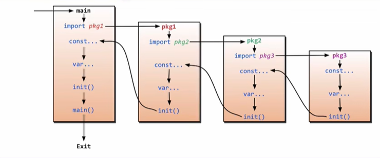
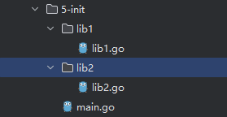
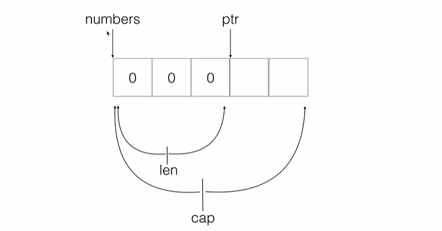
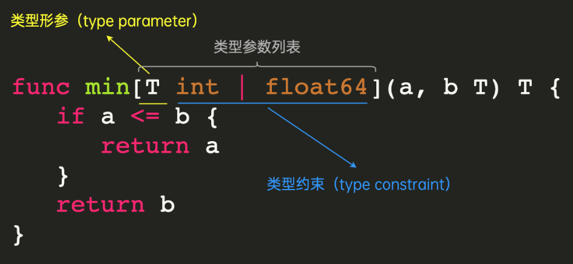
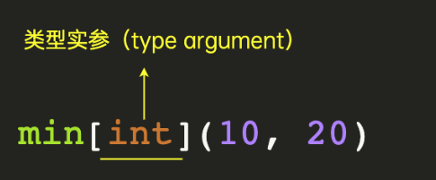
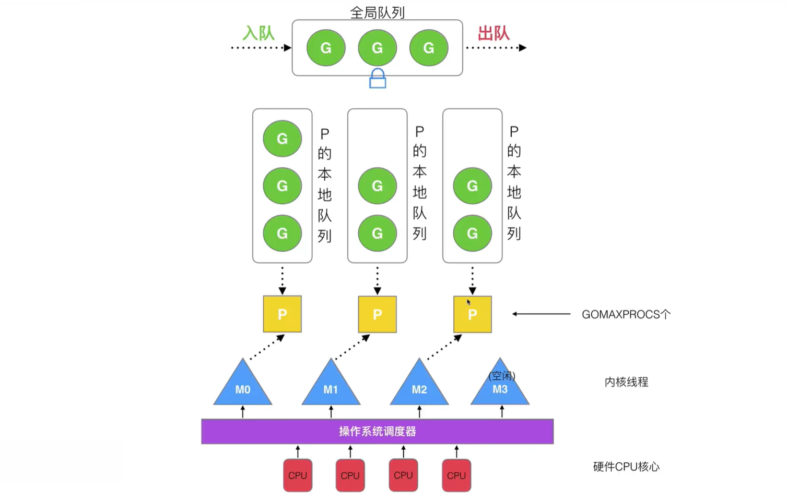

> 适用对象：后端转Go（我是Java）
> 参考教程：[B站刘丹冰](https://www.bilibili.com/video/BV1gf4y1r79E/?spm_id_from=333.337.search-card.all.click&vd_source=34da131fa0b4ef9d62e5e0c78828f630)
> 参考资料：https://www.yuque.com/aceld/mo95lb/dsk886

[TOC]

## Go的语言特性

### Go的优势

1. 极简单的部署方式：
   - 可直接编译为机器码
   - 不依赖其他库
   - 直接运行即可部署
2. 静态类型语言：
   - 编译的时候即可检查出大多数隐藏问题
3. 语言层面上的并发：
   - 原生支持并发协程，充分利用多核CPU
4. 强大的标准库：
   - runtime系统调度机制
   - 高效的GC垃圾回收
   - 丰富的标准库，大多数情况下不引入第三方库即可完成日产开发
5. 简单易学：
   - 只有25个关键字
   - C语言简洁基因，内嵌C语言支持
   - 面向对象特征（封装、继承、多态）
   - 跨平台语言

### Go的不足

1. 包管理，大部分包都在github上
2. 无泛化类型(Golang 1.18+已经支持泛型)
3. 所有Excepiton都用Error来处理(比较有争议)。
4. 对C的降级处理，并非无缝，没有C降级到asm那么完美(序列化问题)

## Go的语法

Hello World示例：

```go
package main //包名，与文件名无关

/* import "fmt"
import "time" */

import (
	"fmt" //导入库，与上面分别导入效果相同
	"time"
)

func main() {//前大括号必须与代码同行
	//每句可带 分号，可不带，推荐不带
	fmt.Println("hello go!")

	time.Sleep(1 * time.Second)
}
```

运行Go：

1. 直接运行：go run hello.go

2. 编译：go build hello.go

   运行：./hello

### 变量的声明

1. 局部变量的声明

   - 方法一：声明一个变量默认的值是0
     var a int

   - 方法二：声明一个变量，初始化一个值

     var b int = 100

   - 方法三：在初始化的时候，可以省去数据类型，通过值自动匹配当前的变量的数据类型

     var c = 100

   - 方法四：（常用的方法）省去var关键字，自动匹配类型并赋值

     e := 100

2. 全局变量的声明：方法四不支持全局变量

3. 一次声明多个变量

   - 单行写法：var xx,yy int = 100, 200

   - 多行写法：

     ```go
     var {
     	xx int= 100
     	yy bool = true
     }
     ```

demo：

```go
package main

import "fmt"

//声明全局变量
var gA int = 100
var gB = "abcd"
//使用 := 声明全局变量是不允许的
// gC := 100

func main() {
	//声明局部变量：
	//方法一：声明一个变量 int默认的值是0
	var a int
	fmt.Println("a = ", a)
	fmt.Printf("type of a is %T\n", a)

	var aa string//默认为 ""
	fmt.Println("aa = ", aa)

	//方法二：声明一个变量，并初始化值
	var b int = 100
	fmt.Println("b = ", b)
	fmt.Printf("type of b is %T\n", b)

	var bb string = "abcd"
	fmt.Printf("bb = %s, type of bb is %T\n", bb, bb)

	//方法三：在初始化时，可以省去数据类型，通过值自动匹配数据类型
	var c = 100
	fmt.Println("c = ", c)
	fmt.Printf("type of c is ", c)

	var cc = "abcd"
	fmt.Printf("cc = %s, type of cc is %T\n", cc, cc)

	//方法四：(常用的方法，但只能声明局部变量)省去var关键字，使用 mod ':'， 直接自动匹配类型并赋值
	e := 100
	fmt.Println("e = ", e)
	fmt.Printf("type of e is %T\n", e)

	f := "abcd"
	fmt.Println("f = ", f)
	fmt.Printf("type of f is %T\n", f)

	g := 3.14
	fmt.Println("g = ", g)
	fmt.Printf("type of g is %T\n", g)


	// =======
	fmt.Println("gA = ", gA, "gB = ", gB)
	// println("gC = ", gC)
}
```

### 常量 和 枚举

1. 常量使用关键字 `const` 进行声明，是只读的，不能修改其值
2. 使用 `const()` 声明枚举，使用关键字 `iota` 来进行自动编号，从0开始，省去人工编号

demo：

```go
package main

import "fmt"

//const 来定义枚举类型
const (
    //可以在const() 添加一个关键字 iota， 每行的iota都会累加1, 第一行的iota的默认值是0
    BEIJING = 10*iota   //iota = 0
    SHANGHAI        //iota = 1
    SHENZHEN          //iota = 2
)

const (
    a, b = iota+1, iota+2 // iota = 0, a = iota + 1, b = iota + 2, a = 1, b = 2
    c, d              // iota = 1, c = iota + 1, d = iota + 2, c = 2, d = 3
    e, f              // iota = 2, e = iota + 1, f = iota + 2, e = 3, f = 4

    g, h = iota * 2, iota *3  // iota = 3, g = iota * 2, h = iota * 3, g = 6, h = 9 
    i, k                  // iota = 4, i = iota * 2, k = iota * 3 , i = 8, k = 12
)

func main() {
    //常量(只读属性)
    const length int = 10

    fmt.Println("length = ", length)

    //length = 100 //常量是不允许修改的。

    fmt.Println("BEIJIGN = ", BEIJING)
    fmt.Println("SHANGHAI = ", SHANGHAI)
    fmt.Println("SHENZHEN = ", SHENZHEN)

    fmt.Println("a = ", a, "b = ", b)
    fmt.Println("c = ", c, "d = ", d)
    fmt.Println("e = ", e, "f = ", f)

    fmt.Println("g = ", g, "h = ", h)
    fmt.Println("i = ", i, "k = ", k)

    // iota 只能够配合const() 一起使用， iota只有在const进行累加效果。
    //var a int = iota 

}
```

### 函数

#### 普通函数与匿名函数的基本使用

使用 `func` 关键字定义函数，Go的函数**可以有多个返回值**

使用 `func() {}()` 来声明并调用一个匿名函数


demo：

```go
package main

import "fmt"

//1 
func foo1(a string, b int) int {
    fmt.Println("a = ", a)
    fmt.Println("b = ", b)

    c := 100

    return c
}

//2 返回多个返回值，匿名的
func foo2(a string, b int) (int, int) {
    fmt.Println("a = ", a)
    fmt.Println("b = ", b)

    return 666, 777
}

//3 返回多个返回值， 有形参名称的
func foo3(a string, b int) (r1 int, r2 int) {
    fmt.Println("---- foo3 ----")
    fmt.Println("a = ", a)
    fmt.Println("b = ", b)

    //r1 r2 属于foo3的形参，  初始化默认的值是0
    //r1 r2 作用域空间 是foo3 整个函数体的{}空间
    fmt.Println("r1 = ", r1)
    fmt.Println("r2 = ", r2)

    //给有名称的返回值变量赋值
    r1 = 1000
    r2 = 2000

    return
}

//4 合并int
func foo4(a string, b int) (r1, r2 int) {
    fmt.Println("---- foo4 ----")
    fmt.Println("a = ", a)
    fmt.Println("b = ", b)

    //给有名称的返回值变量赋值
    r1 = 1000
    r2 = 2000

    return
}

func main() {
    c := foo1("abc", 555)
    fmt.Println("c = ", c)

    ret1, ret2 := foo2("haha", 999)
    fmt.Println("ret1 = ", ret1, " ret2 = ", ret2)

    ret1, ret2 = foo3("foo3", 333)
    fmt.Println("ret1 = ", ret1, " ret2 = ", ret2)

    ret1, ret2 = foo4("foo4", 444)
    fmt.Println("ret1 = ", ret1, " ret2 = ", ret2)
}
```

#### init函数 与 import 导包




golang里面有两个保留的函数：init函数（能够应用于所有的package）和main函数（只能应用于package main）。这两个函数在定义时不能有任何的参数和返回值。go程序会自动调用init()和main()，每个package中的init函数都是可选的，但package main就必须包含一个main函数。

如图，如果main包还导入了其它的包，那么就会在编译时将它们依次导入，可以在其 `init()` 函数中，声明自己想要初始化的东西，他们**都会在主函数main()之前执行**

- **执行顺序：**从main包开始，递归导入最里层的包，直到执行完最里层包的init后，才初始化上一层的常量和变量，最后等所有被导入的包都加载完毕了，就会开始对main包中的包级常量和变量进行初始化，然后执行main包中的init函数（如果存在的话），最后执行main函数
- **import导包注意事项：**我们导包时可以给导入的包起一个别名，然后使用别名来进行调用
  - import aa "fmt"：给fmt包起一个别名aa，aa.Println()来直接调用
  - import _ "fmt"：给fmt包起一个别名**【匿名】**，**无法使用当前包的方法，但是会执行当前的包内部的init()方法**，用于需要执行该包的init函数，但是不需要调用其余方法时使用，不声明为匿名编译器会报错该包没有使用
  - import . "fmt"：将当前fmt包中的全部方法，导入到当前本包的作用中，fmt包的全部的方法可以直接使用API来调用，不需要fmt.API来调用


demo：


```go
package lib1

import "fmt"

//当前lib1包提供的API
func Lib1Test() {
    fmt.Println("lib1Test()...")
}

func init() {
    fmt.Println("lib1. init() ...")
}
```

```go
package lib2

import "fmt"

//当前lib2包提供的API
func Lib2Test() {
	fmt.Println("lib2Test()...")
}

func init() {
	fmt.Println("lib2. init() ...")
}
```

```go
package main

import (
	"GolangStudy/5-init/lib1"
	"GolangStudy/5-init/lib2"
)

func main() {
	lib1.Lib1Test()
	lib2.Lib2Test()
}
```

执行结果：

```
lib1 .init() ...
lib2 .init() ...
Lib1Test....
Lib2Test....
```

#### 闭包

**什么是闭包？**

官方：“闭包”，指的是一个拥有许多变量和绑定了这些变量的环境的表达式（通常是一个函数），因而这些变量也是该表达式的一部分。

**注意：闭包会在使用时实际读取环境变量值，而不是取生成闭包时的环境变量值。**（延迟绑定问题）

闭包案例：

```go
func a() func() int {
    i := 0
    b := func() int {
        i++
        fmt.Println(i)
        return i
    }
    return b
}

func main() {
    c := a()
    c()
    c()
    c()
    
    b := a()
    b()

    a() //不会输出i
}
```

```
输出结果：
1
2
3
1
```

上述代码有以下几个特征：

- 函数 a 返回的是一个函数 b
- 变量 i 是函数 a 中声明的变量
- 变量 i 在函数 b 中使用（绑定了变量的环境）
- c := a()，调用 c 将会输出变量i的值，但是调用 a 不会输出 i 的值
- 变量 i 是局部变量，但是因为闭包的特性，它将**不会被GC**；如果不是闭包，变量 i 将会被GC
- b 和 c 都是通过调用 a 得到的，但是它们的环境却是引用不同的环境，因为每次调用 a 时，i 都是重新初始化的

#### 闭包延迟绑定问题

**延迟绑定问题：**闭包会在使用时实际读取环境变量值，而不是取生成闭包时的环境变量值。

```go
func DelayBidding() func() {
   x := 1//生成闭包的值
   f := func() {
      fmt.Println(x)
   }
   x = 2//实际值
   return f
}

func testDelayBidding() {
   DelayBidding()() // 实际值
}

func main() {
	testDelayBidding()
}
```

```
输出结果：
2
```

**for range延迟绑定问题：**

迭代变量在for range的每次循环中都会被重用，而不是重新声明。所以在for range中使用闭包时，会存在延迟绑定问题，因为i和v本质上是在被复用的，所以闭包被调用时会获取到i和v的最新值：

```go
func TestForRangeDelayBidding() {
   list := []int{1, 2, 3, 4, 5}
   var funcList []func()
   for _, v := range list {//这里的v都是复用的同一个变量
      f := func() {
         fmt.Println(v)
      }
      funcList = append(funcList, f)
   }
   for _, f := range funcList {
      f()
   }
}
```

以上结果预期为1，2，3，4，5，实际输出值为5，5，5，5，5。

一个goroutine的闭包例子：**所有goroutine都是在for range循环完毕过后才开始执行**

```go
func TestForRangeGoRuntineDelayBidding() {
   list := []int{1, 2, 3, 4, 5}
   var wg sync.WaitGroup
   for _, v := range list {
      wg.Add(1)
      go func() {
         defer wg.Done()
         fmt.Println(v)
      }()
   }
   wg.Wait()
}
```

以上结果预期为1，2，3，4，5，实际输出值为5，5，5，5，5。

**怎么解决呢？**

1. 通过参数传递延迟读取的变量的值：改写如下：

```go
func TestForRangeGoRuntineDelayBidding() {
   list := []int{1, 2, 3, 4, 5}
   var wg sync.WaitGroup
   for _, v := range list {
      wg.Add(1)
      go func(v int) {//通过参数传递
         defer wg.Done()
         fmt.Println(v)
      }(v)
   }
   wg.Wait()
}
```

2. 创建一个局部变量

```go
func TestForRangeGoRuntineDelayBidding() {
   list := []int{1, 2, 3, 4, 5}
   var wg sync.WaitGroup
   for _, v := range list {
      wg.Add(1)
       tempV := v
      go func(v int) {//通过参数传递
         defer wg.Done()
         fmt.Println(tempV)
      }(v)
   }
   wg.Wait()
}
```


### 指针（引用传递）

Go支持指针，在对函数的形参进行参数传递时，对于基本数据类型，我们可以**使用指针来进行引用传递**。

对于Java，只支持值传递，我们是无法在方法内修改外部基本数据类型变量的值；对于对象，是拷贝对象的地址，但也是值传递

而**Go**，支持**值传递**和**引用传递**，我们可以使用指针在方法内修改外部基本数据类型变量的值

> 使用 **var a *int** 来声明指针变量，使用 **&a** 来传递变量a的地址

demo：经典swap函数：

```go
package main

import "fmt"

/*
func swap(a int ,b int) {
    2-var temp int
    temp = a
    a = b
    b = temp
}
*/

func swap(pa *int, pb *int) {
    var temp int
    temp = *pa //temp = main::a
    *pa = *pb  // main::a = main::b
    *pb = temp // main::b = temp
}

func main() {
    var a int = 10
    var b int = 20

    swap(&a, &b)

    fmt.Println("a = ", a, " b = ", b)

    var p *int

    p = &a

    fmt.Println(&a)//0xc00000a0e8
    fmt.Println(p)//0xc00000a0e8

    var pp **int //二级指针

    pp = &p

    fmt.Println(&p)//0xc000054030
    fmt.Println(pp)//0xc000054030
}
```

### 延迟调用 defer

关键字 defer 用于注册延迟调用。这些调用直到 return 后才被执。因此，可以用来做资源清理。

- **多个defer的执行顺序**：按先进后出的方式执行。
- **defer和return的执行顺序**：先执行return，再执行defer
  - 与Java语言中的finally相反，Java中，会先执行finally，再执行return

demo：

```go
package main

import "fmt"

// 多个defer的执行顺序
func main() {
	defer fmt.Println(1)
	defer fmt.Println(2)
	defer fmt.Println(3)
}
/*
结果：
3
2
1
*/
```

```go
package main

import "fmt"

// defer 和 return 的执行顺序
func deferFunc() int {
    fmt.Println("deferFunc")
    return 0
}

func returnFunc() int {
    fmt.Println("returnFunc")
    return 0
}

func returnAndDeferFunc() int {
    defer deferFunc()
    return returnFunc()
}

func main() {
    returnAndDeferFunc()
}
/*
结果：
returnFunc
deferFunc
*/
```

### 异常处理

Golang 没有结构化异常，使用 `panic` 抛出错误，`recover` 捕获错误。

异常的使用场景简单描述：Go中可以抛出一个panic的异常，然后在defer中通过recover捕获这个异常，然后正常处理。

**注意事项：**

- 1.利用recover处理panic指令，**defer 必须放在 panic 之前定义**，另外 **recover 只有在 defer 调用的函数中才有效**。否则当panic时，recover无法捕获到panic，无法防止panic扩散。
- 2.recover 处理异常后，逻辑并不会恢复到 panic 那个点去，函数跑到 defer 之后的那个点。
- 3.多个 defer 会形成 defer 栈，后定义的 defer 语句会被最先调用。

```go
func test() {
	defer func() {
        //捕获异常
        if err := recover(); err != nil {
            println(err)
        }
    }()

    //抛出异常
    panic("panic error!")
}
```

```go
//defer表达式捕获可以简写为：
defer func() {
	fmt.Println(recover())
}()
```


多个 延迟调用defer ：因为recover的那个defer最后执行，panic抛出1号异常后并没有被立即捕获，所以需要后来defer中的2号异常覆盖了前一个1号异常，所以最后捕获的异常是2号异常

```go
func test() {
    defer func() {
        fmt.Println(recover())
    }()

    defer func() {
        panic("2 defer panic")
    }()

    panic("1 test panic")
}

func main() {
    test()
}

//输出：2defer panic
```


### 数组 和 动态数组/切片slice

#### 普通数组（值传递）

当我们使用数组时，**如果声明了数组的长度，那么就是一个普通数组**，在我们对函数进行参数传递时，使用的是**值传递**，且**只能传递对应长度的数组**（不同长度的数组对应的是不同的类型，如[10]int）

demo：演示普通数组为值传递，以及for循环遍历数组的两种方式：

```go
package main

import "fmt"

//指明了数组长度
func printArr(arr [10]int) {
	for _, value := range arr {
		fmt.Println(value)
	}
	arr[2] = 10//值传递：此修改对外面的数组不起作用
}

func main() {
	var arr1 [10]int
	arr2 := [10]int{1, 2, 3, 4, 5, 6, 7, 8, 9, 10}
	//fori
	for i := 0; i < len(arr1); i++ {
		fmt.Println(arr1[i])
	}

	printArr(arr2)

	//forr
	for index, value := range arr2 {
		fmt.Println("index = ", index, "value = ", value)
	}
}
```

#### 动态数组/切片slice（引用传递）

##### slice与普通数组的区别

slice：动态数组，也叫切片

当声明数组时**不声明数组长度，我们使用的就是动态数组slice**，类型是 []int，不带长度，在我们对函数进行参数传递时，使用的是**引用传递**

demo：

```go
package main

import "fmt"

func printArray(myArray []int) {
    //引用传递
    // _ 表示匿名的变量
    for _, value := range myArray {
       fmt.Println("value = ", value)
    }

    myArray[0] = 100//引用传递，修改起作用
}

func main() {
    myArray := []int{1, 2, 3, 4} // 动态数组，切片 slice

    fmt.Printf("myArray type is %T\n", myArray)

    printArray(myArray)

    fmt.Println(" ==== ")

    for _, value := range myArray {
       fmt.Println("value = ", value)
    }
}
```

##### 声明slice的4种方式

1. 直接声明并初始化赋值：slice1 := []int{1, 2, 3}
2. 只声明：var slice1 []int
3. 声明并分配空间：var slice1 []int = make([]int, 3)
4. 声明并分配空间，通过 := 推导：slice1 := make([]int, 3)

demo：

```go
package main

import "fmt"

func main() {
    //声明slice1是一个切片，并且初始化，默认值是1，2，3。 长度len是3
    //slice1 := []int{1, 2, 3}

    //声明slice1是一个切片，但是并没有给slice分配空间
    var slice1 []int
    //slice1 = make([]int, 3) //开辟3个空间 ，默认值是0

    //声明slice1是一个切片，同时给slice分配空间，3个空间，初始化值是0
    //2-var slice1 []int = make([]int, 3)

    //声明slice1是一个切片，同时给slice分配空间，3个空间，初始化值是0, 通过:=推导出slice是一个切片
    //slice1 := make([]int, 3)

    fmt.Printf("len = %d, slice = %v\n", len(slice1), slice1)

    //判断一个silce是否为0
    if slice1 == nil {
       fmt.Println("slice1 是一个空切片")
    } else {
       fmt.Println("slice1 是有空间的")
    }
}
```

##### slice切片的追加与扩容

上面我们用到的make函数其实可以传递三个参数：make(type, len, capacity)

当我们只传递两个参数时，capacity = len

numbers := make([]int, 3, 5)：声明一个长度为3，容量为5的切片，如下图所示：


- 我们可以通过 **numbers = append(numbers, 1)** 向切片中追加元素，直到容量cap
- 当容量cap已满后，如果继续向切片中追加元素，那么**cap将会扩容为原来的2倍**，从这一点来看，切片更像Java中的集合

demo：

```go
package main

import "fmt"

func main() {
    var numbers = make([]int, 3, 5)

    fmt.Printf("len = %d, cap = %d, slice = %v\n", len(numbers), cap(numbers), numbers)

    //向numbers切片追加一个元素1, numbers len = 4， [0,0,0,1], cap = 5
    numbers = append(numbers, 1)

    fmt.Printf("len = %d, cap = %d, slice = %v\n", len(numbers), cap(numbers), numbers)

    //向numbers切片追加一个元素2, numbers len = 5， [0,0,0,1,2], cap = 5
    numbers = append(numbers, 2)

    fmt.Printf("len = %d, cap = %d, slice = %v\n", len(numbers), cap(numbers), numbers)

    //向一个容量cap已经满的slice 追加元素，
    numbers = append(numbers, 3)

    fmt.Printf("len = %d, cap = %d, slice = %v\n", len(numbers), cap(numbers), numbers)

    fmt.Println("-=-------")
    var numbers2 = make([]int, 3)
    fmt.Printf("len = %d, cap = %d, slice = %v\n", len(numbers2), cap(numbers2), numbers2)
    numbers2 = append(numbers2, 1)
    fmt.Printf("len = %d, cap = %d, slice = %v\n", len(numbers2), cap(numbers2), numbers2)
}
```

##### slice切片的截取

使用 : 进行数组范围的截取，如：s2 := s1[0:3]，**截取s1的[0,3)区间的引用**，是一个**前闭后开**的区间

- 截取引用：s2 := s1[0:3]，修改s2的某个值，s1也会被修改
- 值拷贝：使用 copy(dst, src) 将src的值拷贝给dst

demo：

```go
func main() {
    s := []int{1, 2, 3} //len = 3, cap = 3, [1,2,3]

    //[0, 2)
    s1 := s[0:2]

    fmt.Println(s1)

    s1[0] = 100

    fmt.Println(s)
    fmt.Println(s1)

    //copy 可以将底层数组的slice一起进行拷贝
    s2 := make([]int, 3) //s2 = [0,0,0]

    //将s中的值 依次拷贝到s2中
    copy(s2, s)
    fmt.Println(s2)
}
```

### map

#### map的声明

使用 make(map[keyType]valueType , cap) 对map进行初始化，无法使用cap()查看map的容量

1. var myMap1 map[string]string = make(map[string]string, 10)
2. myMap2 := make(map[int]string)，拥有默认初始容量
3. myMap3 := map[string]string{ , , ,}

```go
unc main() {
    //===> 第一种声明方式

    //声明myMap1是一种map类型 key是string， value是string
    var myMap1 map[string]string
    if myMap1 == nil {
       fmt.Println("myMap1 是一个空map")
    }

    //在使用map前， 需要先用make给map分配数据空间
    myMap1 = make(map[string]string, 10)

    myMap1["one"] = "java"
    myMap1["two"] = "c++"
    myMap1["three"] = "python"

    fmt.Println(myMap1)

    //===> 第二种声明方式
    myMap2 := make(map[int]string)
    myMap2[1] = "java"
    myMap2[2] = "c++"
    myMap2[3] = "python"

    fmt.Println(myMap2)

    //===> 第三种声明方式
    myMap3 := map[string]string{
       "one":   "php",
       "two":   "c++",
       "three": "python",
    }
    fmt.Println(myMap3)
}
```

#### map的基本操作

- 添加/修改：map1["xxx"] = xxx
- 遍历：使用forr进行遍历，引用传递
- 删除：delete(map, key)

demo：

```go
// 遍历map：引用传递
func printMap(cityMap map[string]string) {
    for k, v := range cityMap {
       fmt.Println("k = ", k, ", v = ", v)
    }
}

func main() {
    //声明
    cityMap := make(map[string]string)

    //添加
    cityMap["China"] = "Beijing"
    cityMap["Japan"] = "Tokyo"
    cityMap["USA"] = "New York"

    //遍历
    printMap(cityMap)

    //删除
    delete(cityMap, "China")

    //修改
    cityMap["USA"] = "DC"

    fmt.Println("--------")
    printMap(cityMap)

}
```

### OOP

#### 结构体struct

可以使用**type**关键字给类型声明别名，如 type myint int 就是给int声明了一个别名叫myint

type 结合 **struct** 关键字可以定义一个结构体，结构体对函数参数的传递**默认是值传递，只有显示使用指针时，才是引用传递**

```go
// 定义一个结构体
type Book struct {
    title string
    auth  string
}
```

demo：

```go
// 声明一种行的数据类型 myint， 是int的一个别名
type myint int

// 定义一个结构体
type Book struct {
    title string
    auth  string
}

func changeBook(book Book) {
    //值传递：传递一个book的副本
    book.auth = "666"
}

func changeBook2(book *Book) {
    //引用传递：指针传递
    book.auth = "777"
}

func main() {
    var book1 Book
    book1.title = "Golang"
    book1.auth = "zhang3"

    fmt.Printf("%v\n", book1)

    changeBook(book1)

    fmt.Printf("%v\n", book1)

    changeBook2(&book1)

    fmt.Printf("%v\n", book1)
}
```

#### 类的封装

上面的结构体其实就是一个类class，只是声明了它的属性，但是没有封装它的方法

我们可以使用如下的形式来为我们的结构体对象封装它的方法：

- func (this Class) funcName：this只是值传递，是对象的值克隆/拷贝
- func (this *Class) funcName：this现在是引用传递，传递的是对象的地址

demo：

```go
//如果类名首字母大写，表示其他包也能够访问
type Hero struct {
	//如果说类的属性首字母大写, 表示该属性是对外能够访问的，否则的话只能够类的内部访问
	Name  string
	Ad    int
	level int
}
//如果方法名大写，代表其它包也能访问
func (this Hero) SetName1(newName string) {
    //值传递：this 只是调用该方法的对象的一个副本（拷贝）
    this.Name = newName
}

func (this *Hero) SetName2(newName string) {
    //引用传递：this指向hero对象的地址
    this.Name = newName
}

func main() {
    //创建一个对象
    hero := Hero{Name: "zhangsan", Ad: 100}
    
    //调用方法
    hero.SetName2("lisi")
}
```

#### 类的继承

采用如下方式继承一个类：

```go
type Human struct {
	name string
	sex  string
}

type SuperMan struct {
	Human //SuperMan类继承了Human类的属性和方法

	level int
}
```

Go的继承也可以重写父类的方法，也可以新增额外的属性和方法：

```go
type Human struct {
    name string
    sex  string
}

func (this *Human) Eat() {
    fmt.Println("Human.Eat()...")
}

//=================

type SuperMan struct {
    Human //SuperMan类继承了Human类的方法

    level int
}

//重定义父类的方法Eat()
func (this *SuperMan) Eat() {
    fmt.Println("SuperMan.Eat()...")
}

func main() {
    h := Human{"zhang3", "female"}

    h.Eat()
    h.Walk()

    //定义一个子类对象
    //s := SuperMan{Human{"li4", "female"}, 88}
    var s SuperMan
    s.name = "li4"
    s.sex = "male"
    s.level = 88

    s.Eat()  //子类的方法
}
```

#### 接口的多态

Go语言中，**多态性只能通过 接口interface 来实现**，不能通过 类class 来实现

Go中**interface本质是一个指针**，会自动指向对应的实现类

一个类实现了某个接口的条件：该类**重写**了接口中声明的**所有方法**，则**自动**实现了该接口

> 因为接口本质是一个指针，所以在 声明接口变量后，对接口变量进行实现类的赋值，**需要赋值的是对象地址**

demo：

```go
//本质是一个指针
type AnimalIF interface {
    Sleep()
    GetColor() string //获取动物的颜色
}

//具体的类
type Cat struct {
    color string //猫的颜色
}

func (this *Cat) Sleep() {
    fmt.Println("Cat is Sleep")
}

func (this *Cat) GetColor() string {
    return this.color
}

//具体的类
type Dog struct {
    color string
}

func (this *Dog) Sleep() {
    fmt.Println("Dog is Sleep")
}

func (this *Dog) GetColor() string {
    return this.color
}

func showAnimal(animal AnimalIF) {
    animal.Sleep() //多态
    fmt.Println("color = ", animal.GetColor())
}

func main() {

    var animal AnimalIF //接口的数据类型， 父类指针
    animal = &Cat{"Green"}

    animal.Sleep() //调用的就是Cat的Sleep()方法 , 多态的现象

    animal = &Dog{"Yellow"}

    animal.Sleep() // 调用Dog的Sleep方法，多态的现象

    cat := Cat{"Green"}
    dog := Dog{"Yellow"}

    showAnimal(&cat)
    showAnimal(&dog)
}
```

#### interface{} / any 和断言

在Go中，所有的数据类型都会实现这个接口：万能数据类型：interface{}，它**可以通过多态传递任何一种数据类型**

> 在Go1.18中，新引入关键字 any，any == interface{}
>
> interface{}、any 类似于Java中的Object
>
> 断言 类似于Java中的强制类型转换

断言：

- 使用 any类型的数据 .(string)，可以获得两个变量 value, ok ，分别代表 值 和 是否断言成功
- 可以在switch中使用 .(type) 来判断其类型

> 注：断言后，变量的类型并未改变，反射的pair部分会详细讲解

```go
//interface{}是万能数据类型
func myFunc(arg interface{}) {
    fmt.Println("myFunc is called...")
    fmt.Println(arg)

    //interface{} 改如何区分 此时引用的底层数据类型到底是什么？

    //给 interface{} 提供 “类型断言” 的机制
    value, ok := arg.(string)
    if !ok {
       fmt.Println("arg is not string type")
    } else {
       fmt.Println("arg is string type, value = ", value)

       fmt.Printf("value type is %T\n", value)
    }
}

type Book struct {
    auth string
}

func main() {
    book := Book{"Golang"}

    myFunc(book)
    myFunc(100)
    myFunc("abc")
    myFunc(3.14)
}
```


### 泛型

#### 为什么需要泛型

假设我们需要实现一个反转切片的函数——`reverse`。

```go
func reverse(s []int) []int {
	l := len(s)
	r := make([]int, l)

	for i, e := range s {
		r[l-i-1] = e
	}
	return r
}

fmt.Println(reverse([]int{1, 2, 3, 4}))  // [4 3 2 1]
```

可是这个函数只能接收`[]int`类型的参数，如果我们想支持`[]float64`类型的参数，我们就需要再定义一个`reverseFloat64Slice`函数。

从Go1.18开始，使用泛型就能够编写出适用所有元素类型的“普适版”`reverse`函数。

```go
func reverseWithGenerics[T any](s []T) []T {
	l := len(s)
	r := make([]T, l)

	for i, e := range s {
		r[l-i-1] = e
	}
	return r
}
```


#### 类型参数

跟普通函数一样，普通函数有 `形参` 和 `实参`，泛型函数有 `类型形参` 和 `类型实参`

类型参数列表看起来像普通的参数列表，只不过它使用方括号（`[]`）而不是圆括号（`()`）。





eg：借助泛型，我们可以声明一个适用于**一组类型**的`min`函数。

```go
func min[T int | float64](a, b T) T {
	if a <= b {
		return a
	}
	return b
}
```

这次定义的`min`函数就同时支持`int`和`float64`两种类型，也就是说当调用`min`函数时，我们既可以传入`int`类型的参数。

```go
m1 := min[int](1, 2)  // 1
```

也可以传入`float64`类型的参数。

```go
m2 := min[float64](-0.1, -0.2)  // -0.2
```

类型实例化分两步进行：

1. 首先，编译器在整个泛型函数或类型中将所有类型形参（type parameters）替换为它们各自的类型实参（type arguments）。
2. 其次，编译器验证每个类型参数是否满足相应的约束。

在成功实例化之后，我们将得到一个非泛型函数，它可以像任何其他函数一样被调用。例如：

```go
fmin := min[float64] // 类型实例化，编译器生成T=float64的min函数
m2 = fmin(1.2, 2.3)  // 1.2
```


#### 类型推断

constrains：https://pkg.go.dev/golang.org/x/exp/constraints 包提供了一些常用类型。

1. constraints包的主要类型：
```go
// 支持所有整数类型
type Integer interface {
    Signed | Unsigned
}

// 支持所有有序类型(可比较大小的类型)
type Ordered interface {
    Integer | Float | ~string
}

// 示例使用
func Min[T constraints.Ordered](a, b T) T {
    if a < b {
        return a
    }
    return b
}
```

2. 类型推断的两种主要形式：

**A. 函数参数类型推断：**

```go
// 不需要显式指定类型
var x, y float64 = 1.0, 2.0
min := Min(x, y)      // 编译器自动推断T为float64

// 等价于显式指定：
min := Min[float64](x, y)
```

**B. 约束类型推断：**

```go
// 自定义Point类型
type Point []int32

// 泛型Scale函数
func Scale[E constraints.Integer](s []E, c E) []E // 这种方式将不能调用Point类型的方法，因为函数返回的是 []E 只能推断为 []int32 类型
func Scale[S ~[]E, E constraints.Integer](s S, c E) S {	// 这种可以，函数返回的是 S 类型，代表推断为Point结构体
    r := make(S, len(s))
    for i, v := range s {
        r[i] = v * c
    }
    return r
}

// 使用示例
p := Point{1, 2, 3}
scaled := Scale(p, 2)  // 编译器能推断出S=Point, E=int32
```

关键点解释：

1. `~[]E` 表示底层类型是`[]E`的所有类型：
```go
type Point []int32    // Point的底层类型是[]int32
type Vector []int32   // Vector的底层类型也是[]int32
```

2. 约束类型推断的工作过程：
```go
// 当调用Scale(p, 2)时:
// 1. 从参数p推断出S的类型是Point
// 2. 从约束~[]E知道Point必须是某个[]E类型
// 3. 因为Point是[]int32，所以E必须是int32
```

3. 实际应用示例：
```go
// 通用的数据处理函数
func Process[T any, S ~[]T](data S) S {
    result := make(S, len(data))
    for i, v := range data {
        // 处理每个元素
        result[i] = v
    }
    return result
}

// 可以处理自定义类型
type IntList []int
type FloatList []float64

nums := IntList{1, 2, 3}
processed := Process(nums)  // 自动推断T=int, S=IntList
```


### 反射

#### pair

Golang关于类型设计的一些原则：

- 变量：一个变量是一个 **pair(type, value)** 对
  1. type：
     - static type：编码时看见的类型(如int、string)
     - concrete type：运行时系统看见的类型(interface类型)
  2. value

接下来要讲的反射，就是建立在类型之上的：**static type在创建变量的时候就已经确定**，而**concrete type才与反射有关**

一个interface{}类型的变量包含了2个指针，一个指针指向值的类型【对应concrete type】，另外一个指针指向实际的值【对应value】。

> **interface{}类型的变量，在赋值过程中，pair中的type始终保持不变**
>
> 即**断言后，变量的类型并未改变**

如下示例demo1：pair中的type在赋值过程中保持不变

```go
func main() {
    var a string
    //pair<statictype:string, value:"aceld">
    a = "aceld"

    var allType interface{}
    
    //pair<type:string, value:"aceld">
    allType = a

    str, _ := allType.(string)
    fmt.Println(str)
}
```


demo2：断言后，变量的类型并未改变

```go
type Reader interface {
    ReadBook()
}

type Writer interface {
    WriteBook()
}

//具体类型
type Book struct {
}

func (this *Book) ReadBook() {
    fmt.Println("Read a Book")
}

func (this *Book) WriteBook() {
    fmt.Println("Write a Book")
}

func main() {
    //b: pair<type:Book, value:book{}地址>
    b := &Book{}

    //r: pair<type:, value:>
    var r Reader
    //r: pair<type:Book, value:book{}地址>
    r = b

    r.ReadBook()

    var w Writer
    //r: pair<type:Book, value:book{}地址>
    w = r.(Writer) //此处的断言为什么会成功？ 因为w r 具体的type是一致

    w.WriteBook()
}
```

#### 反射的基本使用

使用反射获取变量的类型、值，如果传入的是对象，那么可以获取他的字段的 类型(包括type, name) 、 值 、方法

- inputType := reflect.TypeOf(input)
  - 如果input是对象，那么可以进一步获取其中的字段：field := inputType.Field(i)
    - 字段名：field.Name
    - 字段类型：field.Type
  - 方法：method := inputType.Method(i)
    - 方法名：method.Name
    - 方法类型：method.Type
    - 调用方法：method.Func.Call([]reflect.Value{inputValue})
- inputValue := reflect.ValueOf(input)
  - 如果input是对象，那么可以进一步获取其中的字段值：value := inputValue.Field(i)
    - 可以通过value读取值，通用的数据类型读取：value.Interface()


demo：

```go
type User struct {
	Id   int
	Name string
	Age  int
}

func (this User) Call() {
	fmt.Println("user is called ..")
	fmt.Printf("%v\n", this)
}

func DoFiledAndMethod(input interface{}) {
	//获取input的type
	inputType := reflect.TypeOf(input)
	fmt.Println("inputType is :", inputType.Name())

	//获取input的value
	inputValue := reflect.ValueOf(input)
	fmt.Println("inputValue is:", inputValue)

	//通过type 获取里面的字段
	//1. 获取interface的reflect.Type，通过Type得到NumField, 即字段的个数 ,进行遍历
	//2. 通过下标 i 得到每个field，数据类型Type，可以获得该Type的 类型 和 字段名
	//3. 通过Filed有一个Interface()方法得到 对应的value
	for i := 0; i < inputType.NumField(); i++ {
		field := inputType.Field(i)
		value := inputValue.Field(i).Interface()

		fmt.Printf("%s: %v = %v\n", field.Name, field.Type, value)
	}

	//通过type 获取里面的方法,调用
	for i := 0; i < inputType.NumMethod(); i++ {
		m := inputType.Method(i)
		fmt.Printf("%s: %v\n", m.Name, m.Type)

		//调用方法
		m.Func.Call([]reflect.Value{inputValue})
	}
}

func main() {
	user := User{1, "Aceld", 18}

	DoFiledAndMethod(user)
}

```

#### Go的反射慢的主要原因

Golang reflect慢主要有两个原因：

1. 涉及到内存分配以及后续的GC；
2. reflect实现里面有大量的枚举，也就是for循环，比如类型之类的


Golang的反射很慢，这个和它的API设计有关。在 java 里面，我们一般使用反射都是这样来弄的：

```csharp
Field field = clazz.getField("hello");
field.get(obj1);
field.get(obj2);
```

Java中这个取得的反射对象类型是 java.lang.reflect.Field。它是**可以复用**的。只要传入不同的obj，就可以取得这个obj上对应的 field。


但是Golang的反射不是这样设计的:

```go
type_ := reflect.TypeOf(obj)
field, _ := type_.FieldByName("hello")
```

这里取出来的 field 对象是 reflect.StructField 类型，但是它没有办法用来取得对应对象上的值。如果要取值，得用另外一套对object，而不是type的反射

```go
type_ := reflect.ValueOf(obj)
fieldValue := type_.FieldByName("hello")
```

这里取出来的 fieldValue 类型是 reflect.Value，它是一个具体的值，而**不是一个可复用**的反射对象了，**每次反射都需要malloc这个reflect.Value结构体，并且还涉及到GC**。

### 结构体标签tag

#### tag的声明 与 用反射获取tag

声明结构体后，在每个字段的后面使用 `` 括起来，起到类似于comments的作用

如下：其中 info 和 doc 是程序员自己约定的，可以自定义

```go
type resume struct {
    Name string `info:"name" doc:"我的名字"`
    Sex  string `info:"sex" doc:"性别"`
}
```


demo：使用反射获取到tag：

```go
type resume struct {
    Name string `info:"name" doc:"我的名字"`
    Sex  string `info:"sex" doc:"性别"`
}

func findTag(input any) {
    elem := reflect.TypeOf(input).Elem()
    for i := 0; i < elem.NumField(); i++ {
       tagInfo := elem.Field(i).Tag.Get("info")
       tagDoc := elem.Field(i).Tag.Get("doc")
       fmt.Println("tagInfo: ", tagInfo, ", tagDoc: ", tagDoc)
    }
}

func main() {
    var re resume
    //要传地址
    findTag(&re)
}
```

#### tag在json中的使用

当我们使用json库对结构体在 struct 与 json 之间的转换时，字段名将会被替换成 tag中的json标识


demo：

```go
type Movie struct {
    Title  string   `json:"title"`
    Year   int      `json:"year"`
    Price  int      `json:"rmb"`
    Actors []string `json:"actors"`
}

func main() {
    movie := Movie{"喜剧之王", 2000, 10, []string{"xingye", "zhangbozhi"}}

    //编码的过程  结构体---> json
    jsonStr, err := json.Marshal(movie)
    if err != nil {
       fmt.Println("json marshal error", err)
       return
    }

    fmt.Printf("jsonStr = %s\n", jsonStr)

    //解码的过程 jsonstr ---> 结构体
    //jsonStr = {"title":"喜剧之王","year":2000,"rmb":10,"actors":["xingye","zhangbozhi"]}
    myMovie := Movie{}
    err = json.Unmarshal(jsonStr, &myMovie)
    if err != nil {
       fmt.Println("json unmarshal error ", err)
       return
    }

    fmt.Printf("%v\n", myMovie)
}
```

## Go高阶

### Goroutine

#### Go协程的使用

使用关键字 `go` 来直接开启一个goroutine

使用 `runtime.Goexit()` 来退出一个goroutine，不能使用return，因为若return只能退出一层函数，若想在多层函数里退出协程，只能使用Goexit()

> 若 mian go 执行结束，那么 sub go 也会结束
>
> **注意事项：**所有goroutine都是在for range循环完毕过后才开始执行

demo：

```go
func main() {
    //用go创建承载一个形参为空，返回值为空的一个函数
    go func() {
       defer fmt.Println("A.defer")

       func() {
          defer fmt.Println("B.defer")
          //退出当前goroutine
          runtime.Goexit()
          fmt.Println("B")
       }()

       fmt.Println("A")
    }()

    //死循环
    for {
       time.Sleep(1 * time.Second)
    }
}
```

#### Go协程调度器的设计策略(GMP)

Golang将协程（co-routine）改了个名字，叫做**Goroutine**，内存占用只有4KB

- **内核级线程的缺点(线程 : 协程 = 1 : 1)：**每个线程占用的内存较高(4M)，且内核级切换的开销大，CPU切换的成本高
- **线程 : 协程 = 1 : N：**当协程出现阻塞时，这一组协程将会阻塞
- **线程 : 协程 = M : N：**通过用户空间自己实现的**协程调度器**进行调度


Go语言协程调度器的设计：

GMP：

- G：goroutine协程
- P：processor处理器
- M：thread内核线程



操作系统内核空间中，由操作系统调度器进行CPU与内核线程之间的调度，我们无需涉及

但是：在用户空间中，我们需要实现协程调度器通过，来调度内核线程(CPU)与协程

- 可以通过设置 `宏GOMAXPROCS` 来指定processor的个数，**每个processor同时只能运行一个goroutine**，所以**Go协程的最大并发数就是processor的个数**
- 每个processor有自己的P的本地队列，里面有一些待运行的goroutine，当P的本地队列都装不下时，才会装入到全局队列中

调度器的**设计策略**：

- 复用线程：
  - **work stealing机制**：当某个processor的 P的本地队列 没有G时，可以向其它 P的本地队列 偷取一个G来运行，若也没有，则 加锁 从全局G队列偷取
  - **hand off机制**：当一个 线程M0 处理某个G时，该G发生阻塞，那么将会 创建/唤醒 一个新的线程M1，然后将原来M0负责的processor整体迁移给M1负责，然后原来的M0带着阻塞的G一起睡眠/销毁，当G唤醒后，如果还需执行会将加入到其它本地队列运行
- 利用并行：通过设置 宏GOMAXPROCS 来限定 processor 的个数，即 CPU的使用核心数 / 最大并行数
- 抢占：CPU 与 goroutine 的关系，也是类似于时间片的，当CPU对正在运行的goroutine的时间片用完过后，是会被其它goroutine抢占CPU的
- 全局G队列：存放本地队列放不下的goroutine，processor可以从全局队列偷取goroutine

#### runtime包

- runtime.Gosched()：当前goroutine**让出CPU时间片**，重新等待安排任务
- runtime.Goexit()：**退出**当前协程
- runtime.GOMAXPROCS()：设置宏：设置goroutine的**并发数**

#### Goroutine池

worker pool（goroutine池）：

- 本质上是生产者消费者模型
- 可以有效控制goroutine数量，防止暴涨

创建 pool 的demo：**其实就是写一个for循环去 开协程**

```go
// 创建工作池
// 参数1：开几个协程
func createPool(num int) {
    // 根据开协程个数，去跑运行
    for i := 0; i < num; i++ {
        go func() {
            // 执行任务
            ...
        }(
    }
}
```

### Channel

#### Channel的引入 与 基本使用

引入案例：

```go
go func(a int, b int) bool {
    fmt.Println("a = ", a, ", b = ", b)
    return true
}(10, 20)
```

在这个 go程 运行的函数中，具有返回值，那么我们该**如何获取到这个返回值**呢？我们是无法直接对这个go语句接受值的

就需要用到我们的`Channel`，并发核心单元通过它就可以发送或者接收数据进行通讯，这在一定程度上又进一步降低了编程的难度。channel是一个数据类型，主要用来解决go程的**同步**问题以及go程之间**数据共享**（数据传递）的问题。

引⽤类型 channel可用于多个 goroutine 通讯。**其内部实现了同步，确保并发安全**。


创建channel / 向channel发送value / 从channel读取数据 / 关闭channel：

```go
make(chan Type)  	//创建无缓冲channel，等价于make(chan Type, 0)
make(chan Type, capacity)//创建有缓冲channel
channel <- value      //发送value到channel
<-channel             //接收并将其丢弃
x := <-channel        //从channel中接收数据，并赋值给x
x, ok := <-channel    //同时ok检查通道是否已关闭或者是否为空，true代表未关闭或已关闭但缓冲有数据
close(channel)		  //关闭channel，关闭后不能发数据，但是可以接收数据
```


**channel的同步策略：**

- 当读取channel中的数据时，若数据尚未准备好，将会阻塞
- 当往channel中发送数据时，若channel缓冲已满，将会阻塞

如下这个demo：多次运行下面这个demo的结果都是一致的，为什么main线程总是能获取到 channel 传递过来的值？而不是main go程先结束？因为channel具有同步策略

```go
func main() {
    //定义一个channel
    c := make(chan int)

    go func() {
       defer fmt.Println("goroutine结束")

       fmt.Println("goroutine 正在运行...")

       c <- 666 //将666 发送给c
    }()

    num := <-c //从c中接受数据，并赋值给num

    fmt.Println("num = ", num)
    fmt.Println("main goroutine 结束...")
}
```

#### Channel 与 range（channel的接收）

若为有缓存channel，当我们接收chanel中数据时，可以使用 **v, ok := <-c** 中的ok来判断channel的状态

一种写法（复杂）：

```go
func main() {
    c := make(chan int)

    go func() {
       for i := 0; i < 5; i++ {
          c <- i
          //close可以关闭一个channel
          close(c)
       }
    }()

    //死循环接收channel中的数据，直到channel关闭
    for {
       //ok如果为true表示channel没有关闭，如果为false表示channel已经关闭
       if data, ok := <-c; ok {
          fmt.Println(data)
       } else {
          break
       }
    }

    fmt.Println("Main Finished..")
}
```

但是这种写法太复杂了，我们可以**配合 range 来简化：**

将上面的死循环，替换为 for range：

```go
for v := range c {
    fmt.Println(v)
}
```

#### Channel 与 select

当我们想要监听多个channel时，就需要用到 `select` 关键字，类似于多路复用

有时候我们希望能够借助channel发送或接收数据，并避免因为发送或者接收导致的阻塞，尤其是当channel没有准备好写或者读时。select语句就可以实现这样的功能。

select的用法与switch语言非常类似，由select开始一个新的选择块，每个选择条件由case语句来描述。

与switch语句相比，select有比较多的限制，其中最大的一条限制就是**每个case语句里必须是一个IO操作**，大致的结构如下：

```go
select {
case <- chan1:
    // 如果chan1成功读到数据，则进行该case处理语句
case chan2 <- 1:
    // 如果成功向chan2写入数据，则进行该case处理语句
default:
    // 如果上面都没有成功，则进入default处理流程
}
```

- select可以同时监听一个或多个channel，直到其中一个channel ready
- 如果多个channel同时ready，则随机选择一个执行

在一个select语句中，Go语言会按顺序从头至尾评估每一个发送和接收的语句。如果其中的任意一语句可以继续执行(即没有被阻塞)，那么就从那些可以执行的语句中任意选择一条来使用。如果没有任意一条语句可以执行(即所有的通道**都被阻塞**)，那么有两种可能的情况：

- 如果给出了default语句，那么就会执行default语句，同时程序的执行会从select语句后的语句中恢复。
- 如果没有default语句，那么select语句将被阻塞，直到至少有一个通信可以进行下去。


demo：

```go
func main() {
    c := make(chan int)
    quit := make(chan int)

    go func() {
       //一连从c中读取10次数据
       for i := 0; i < 10; i++ {
          //从c中读取数据
          fmt.Println(<-c)
       }
       quit <- 0
    }()

    //向c中写数据
    x, y := 1, 1
    for {
       select {
       case c <- x://若c可写
          x = y
          y = x + y
       case <-quit://若quit可读
          fmt.Println("quit")
          close(c)
          close(quit)
          return
       }
    }
}
```

### sync包 和 atomic 包

#### (读写)互斥锁

互斥锁是一种常用的控制共享资源访问的方法，它能够保证同时只有一个goroutine可以访问共享资源。Go语言中使用sync包的Mutex类型来实现互斥锁。 

```go
var lock sync.Mutex
lock.Lock()//上锁
...
lock.Unlock()//解锁
```

互斥锁是完全互斥的，但是有很多实际的场景下是读多写少的，当我们并发的去读取一个资源不涉及资源修改的时候是没有必要加锁的，这种场景下使用读写锁是更好的一种选择。读写锁在Go语言中使用sync包中的RWMutex类型。

读写锁分为两种：读锁和写锁。当一个goroutine获取读锁之后，其他的goroutine如果是获取读锁会继续获得锁，如果是获取写锁就会等待；当一个goroutine获取写锁之后，其他的goroutine无论是获取读锁还是写锁都会等待。

```go
rwlock sync.RWMutex
// rwlock.Lock() 			 // 加写锁
rwlock.RLock()               // 加读锁
...
rwlock.RUnlock()             // 解读锁
// rwlock.Unlock()           // 解写锁
```

#### sync.WaitGroup

Go语言中可以使用sync.WaitGroup来实现并发任务的同步。 sync.WaitGroup有以下几个方法：

| 方法名                          | 功能                |
| ------------------------------- | ------------------- |
| (wg * WaitGroup) Add(delta int) | 计数器+delta        |
| (wg *WaitGroup) Done()          | 计数器-1            |
| (wg *WaitGroup) Wait()          | 阻塞直到计数器变为0 |

sync.WaitGroup内部维护着一个**计数器**，计数器的值可以增加和减少。例如当我们启动了N 个并发任务时，就将计数器值增加N。每个任务完成时通过调用Done()方法将计数器减1。通过调用Wait()来等待并发任务执行完，当**计数器值为0时，表示所有并发任务已经完成，然后才开始执行Wait之后的代码。**

#### sync.Once

在编程的很多场景下我们需要确保某些操作在高并发的场景下**只执行一次**，例如只加载一次配置文件、只关闭一次通道等。

sync.Once只有一个Do方法，其签名如下：

```go
func (o *Once) Do(f func()) {}
```

注意：如果要执行的函数f需要**传递参数**就需要**搭配闭包**来使用。

不用init的原因：init会增加程序的启动耗时，而且初始化的东西不一定能用上

原理：**sync.Once其实内部包含一个互斥锁和一个布尔值**，互斥锁保证布尔值和数据的安全，而布尔值用来记录初始化是否完成。这样设计就能保证初始化操作的时候是并发安全的并且初始化操作也不会被执行多次。

> **加载配置文件示例：**
>
> 延迟一个开销很大的初始化操作到真正用到它的时候再执行是一个很好的实践。因为预先初始化一个变量（比如在init函数中完成初始化）会增加程序的启动耗时，而且有可能实际执行过程中这个变量没有用上，那么这个初始化操作就不是必须要做的。我们来看一个例子：
>
> ```go
> var icons map[string]image.Image
> 
> func loadIcons() {
>     icons = map[string]image.Image{
>         "left":  loadIcon("left.png"),
>         "up":    loadIcon("up.png"),
>         "right": loadIcon("right.png"),
>         "down":  loadIcon("down.png"),
>     }
> }
> 
> // Icon 被多个goroutine调用时不是并发安全的
> func Icon(name string) image.Image {
>     if icons == nil {
>         loadIcons()
>     }
>     return icons[name]
> }
> ```
>
> 多个goroutine并发调用Icon函数时不是并发安全的，现代的编译器和CPU可能会在保证每个goroutine都满足串行一致的基础上自由地重排访问内存的顺序。loadIcons函数可能会被**重排**为以下结果：
>
> ```go
> func loadIcons() {
>     icons = make(map[string]image.Image)
>     icons["left"] = loadIcon("left.png")
>     icons["up"] = loadIcon("up.png")
>     icons["right"] = loadIcon("right.png")
>     icons["down"] = loadIcon("down.png")
> }
> ```
>
> 在这种情况下就会出现即使判断了icons不是nil也不意味着变量初始化完成了（可能是只make完成）。考虑到这种情况，我们能想到的办法就是添加互斥锁，保证初始化icons的时候不会被其他的goroutine操作，但是这样做又会引发性能问题。
>
> 使用sync.Once改造的示例代码如下：
>
> ```go
> var icons map[string]image.Image
> 
> var loadIconsOnce sync.Once
> 
> func loadIcons() {
>     icons = map[string]image.Image{
>         "left":  loadIcon("left.png"),
>         "up":    loadIcon("up.png"),
>         "right": loadIcon("right.png"),
>         "down":  loadIcon("down.png"),
>     }
> }
> 
> // Icon 是并发安全的
> func Icon(name string) image.Image {
>     loadIconsOnce.Do(loadIcons)
>     return icons[name]
> }
> ```
>
> **sync.Once其实内部包含一个互斥锁和一个布尔值**，互斥锁保证布尔值和数据的安全，而布尔值用来记录初始化是否完成。这样设计就能保证初始化操作的时候是并发安全的并且初始化操作也不会被执行多次。

#### sync.Map

Go语言中内置的map不是并发安全的。这种场景下就需要为map加锁来保证并发的安全性了，Go语言的sync包中提供了一个开箱即用的**并发安全版map：sync.Map**。开箱即用表示不用像内置的map一样使用make函数初始化就能直接使用。同时sync.Map内置了诸如Store、Load、LoadOrStore、Delete、Range等操作方法。

demo：

```go
var m = sync.Map{}

func main() {
    wg := sync.WaitGroup{}
    for i := 0; i < 20; i++ {
        wg.Add(1)
        go func(n int) {
            key := strconv.Itoa(n)
            m.Store(key, n)
            value, _ := m.Load(key)
            fmt.Printf("k=:%v,v:=%v\n", key, value)
            wg.Done()
        }(i)
    }
    wg.Wait()
}
```

#### 原子操作

代码中的**加锁操作因为涉及内核态的上下文切换会比较耗时、代价比较高**。针对**基本数据类型**我们还可以使用原子操作来保证并发安全，因为**原子操作**是Go语言提供的方法它在**用户态**就可以完成，因此**性能比加锁操作更好**。Go语言中原子操作由内置的标准库sync/atomic提供。

atomic包提供了底层的原子级内存操作，对于同步算法的实现很有用。这些函数必须谨慎地保证正确使用。除了某些特殊的底层应用，使用通道或者sync包的函数/类型实现同步更好。

**atomic包：**

| 方法                                                         | 解释       |
| :----------------------------------------------------------- | ---------- |
| func LoadInt32(addr `*int32`) (val int32) <br/>func LoadInt64(addr `*int64`) (val int64)<br>func LoadUint32(addr`*uint32`) (val uint32)<br>func LoadUint64(addr`*uint64`) (val uint64)<br>func LoadUintptr(addr`*uintptr`) (val uintptr)<br>func LoadPointer(addr`*unsafe.Pointer`) (val unsafe.Pointer) | 读取操作   |
| func StoreInt32(addr `*int32`, val int32) <br/>func StoreInt64(addr `*int64`, val int64) <br/>func StoreUint32(addr `*uint32`, val uint32) <br/>func StoreUint64(addr `*uint64`, val uint64) <br/>func StoreUintptr(addr `*uintptr`, val uintptr) <br/>func StorePointer(addr `*unsafe.Pointer`, val unsafe.Pointer) | 写入操作   |
| func AddInt32(addr `*int32`, delta int32) (new int32) <br/>func AddInt64(addr `*int64`, delta int64) (new int64) <br/>func AddUint32(addr `*uint32`, delta uint32) (new uint32) <br/>func AddUint64(addr `*uint64`, delta uint64) (new uint64) <br/>func AddUintptr(addr `*uintptr`, delta uintptr) (new uintptr) | 修改操作   |
| func SwapInt32(addr `*int32`, new int32) (old int32) <br/>func SwapInt64(addr `*int64`, new int64) (old int64) <br/>func SwapUint32(addr `*uint32`, new uint32) (old uint32) <br/>func SwapUint64(addr `*uint64`, new uint64) (old uint64)<br/>func SwapUintptr(addr `*uintptr`, new uintptr) (old uintptr)<br/>func SwapPointer(addr `*unsafe.Pointer`, new unsafe.Pointer) (old unsafe.Pointer) | 交换操作   |
| func CompareAndSwapInt32(addr `*int32`, old, new int32) (swapped bool) <br/>func CompareAndSwapInt64(addr `*int64`, old, new int64) (swapped bool)<br/>func CompareAndSwapUint32(addr `*uint32`, old, new uint32) (swapped bool) <br/>func CompareAndSwapUint64(addr `*uint64`, old, new uint64) (swapped bool) <br/>func CompareAndSwapUintptr(addr `*uintptr`, old, new uintptr) (swapped bool) <br/>func CompareAndSwapPointer(addr `*unsafe.Pointer`, old, new unsafe.Pointer) (swapped bool) | 比较并交换 |

demo：比较下互斥锁和原子操作的性能：

```go
var x int64
var l sync.Mutex
var wg sync.WaitGroup

// 普通版加函数
func add() {
    // x = x + 1
    x++ // 等价于上面的操作
    wg.Done()
}

// 互斥锁版加函数
func mutexAdd() {
    l.Lock()
    x++
    l.Unlock()
    wg.Done()
}

// 原子操作版加函数
func atomicAdd() {
    atomic.AddInt64(&x, 1)
    wg.Done()
}

func main() {
    start := time.Now()
    for i := 0; i < 10000; i++ {
        wg.Add(1)
        // go add()       // 普通版add函数 不是并发安全的
        // go mutexAdd()  // 加锁版add函数 是并发安全的，但是加锁性能开销大
        go atomicAdd() // 原子操作版add函数 是并发安全，性能优于加锁版
    }
    wg.Wait()
    end := time.Now()
    fmt.Println(x)
    fmt.Println(end.Sub(start))
}
```

### Go Modules

#### GOPATH工作模式的弊端

在 GOPATH 的 `$GOPATH/src` 下进行 `.go` 文件或源代码的存储，我们可以称其为 GOPATH 的模式，这个模式拥有一些弊端.

- **A. 无版本控制概念.** 在执行`go get`的时候，你无法传达任何的版本信息的期望，也就是说你也无法知道自己当前更新的是哪一个版本，也无法通过指定来拉取自己所期望的具体版本

- **B.无法同步一致第三方版本号.** 在运行 Go 应用程序的时候，你无法保证其它人与你所期望依赖的第三方库是相同的版本，也就是说在项目依赖库的管理上，你无法保证所有人的依赖版本都一致。
- **C.无法指定当前项目引用的第三方版本号.**  你没办法处理 v1、v2、v3 等等不同版本的引用问题，因为 GOPATH 模式下的导入路径都是一样的，都是`github.com/foo/bar`。


`Go modules` 是 Go 语言的依赖解决方案，发布于 Go1.11，成长于 Go1.12，丰富于 Go1.13，正式于 Go1.14 推荐在生产上使用。

Go moudles 目前集成在 Go 的工具链中，只要安装了 Go，自然而然也就可以使用 Go moudles 了，而 Go modules 的出现也解决了在 Go1.11 前的几个常见争议问题：

1. Go 语言长久以来的依赖管理问题。
2. “淘汰”现有的 GOPATH 的使用模式。
3. 统一社区中的其它的依赖管理工具（提供迁移功能）。

#### Go Modules模式

Go Modules 就是一个类似于 Java 中 Maven 的依赖管理工具，它的本地仓库地址就是 $GOPATH/pkg

##### go mod命令

| 命令              | 作用                             |
| ----------------- | -------------------------------- |
| **go mod init**   | 生成 go.mod 文件                 |
| go mod download   | 下载 go.mod 文件中指明的所有依赖 |
| go mod tidy       | 整理现有的依赖                   |
| go mod graph      | 查看现有的依赖结构               |
| go mod edit       | 编辑 go.mod 文件                 |
| **go mod vendor** | 导出项目所有的依赖到vendor目录   |
| go mod verify     | 校验一个模块是否被篡改过         |
| go mod why        | 查看为什么需要依赖某模块         |

##### go mod环境变量

- 查看go环境变量：**go env** [ grep/findstr xxx]
- 修改go环境变量：
  - **go env -w** xxx=xxx
  - 修改操作系统的环境变量

与 Go Modules 相关的go环境变量：

1. **GO11MODULE**：是否开启gomodules模式，设置为auto代表如含.mod文件则开启，建议goV1.11之后，都设置为on
2. **GOPROXY**：项目的第三方依赖库的下载源地址
   - 建议设置为国内的地址：阿里云https://mirrors.aliyun.com/goproxy/	七牛云https://goproxy.cn,direct 
   - direct 用于指示Go回源到模块版本的源地址去抓取（比如GitHub等）
3. GOSUMDB：用来校验拉取的第三方库是否是完整的；默认也是国外的网站，如果设置了GOPROXY，这个就不用设置了
4. GONOPROXY：不从GOPROXY下载的；通过设置GOPRIVATE即可
5. GONOSUMDB：不需要校验的第三方库；通过设置GOPRIVATE即可
6. **GOPRIVATE**：设置私有仓库；如：go env -w GOPRIVATE="git.example.com,github.com/aceld/zinx"
   - 表示git.example.com和github.com/aceld/zinx是私有仓库，不会进行GOPROXY下载和校验
   - *.example.com：表示所有模块路径为example.com的子域名都不进行GOPROXY下载和校验

##### 初始化项目

1. 创建项目目录：mkdir -p .../spongehah/modules_test
2. 初始化项目：**go mod init** github.com/spongehah/modules_test
   - 指定了模块导入路径为  github.com/spongehah/modules_test
   - 会生成一个 go.mod 文件
3. 编写代码后，如果我们依赖某些第三方库，可以动过 go get 命令手动down，也可以在go run时自动down，下载下来的依赖将会放到 $GOPATH/pkg/ 下去
4. down后，go.mod 文件中，会自动添加 down 好的依赖，包括 **依赖路径、版本**，//indirect 表示间接依赖
5. down后，生成一个 go.sum 文件，罗列当前项目直接或间接的 **依赖所有模块、版本、对模块整体的hash值**或对mod文件的hash值，保证今后项目依赖的版本不会被纂改

##### 修改模块的版本依赖关系

当我们要修改对某个第三方库的依赖版本时，可以使用以下 **go mod edit** 命令进行版本更改：

```bash
$ go mod edit -replace=zinx@v0.0.0-20200306023939-bc416543ae24=zinx@v0.0.0-20200221135252-8a8954e75100
```

### 单元测试

#### 单元测试规范

Go语言中的测试依赖`go test`命令。编写测试代码和编写普通的Go代码过程是类似的

在包目录内，所有以`_test.go`为后缀名的源代码文件都是go test测试的一部分，不会被go build编译到最终的可执行文件中。

在`*_test.go`文件中有三种类型的函数，单元测试函数、基准测试函数和示例函数：

| 类型     | 函数名格式            | 参数(必须为) | 作用                           |
| -------- | --------------------- | ------------ | ------------------------------ |
| 测试函数 | 函数名前缀为Test      | t *testing.T | 测试程序的一些逻辑行为是否正确 |
| 基准函数 | 函数名前缀为Benchmark | b *testing.B | 测试函数的性能                 |
| 示例函数 | 函数名前缀为Example   | 无           | 为文档提供示例文档             |

> go test 命令的可携带参数：
>
> - 普通参数：
>   - -v：查看所有测试函数名称和运行时间，若_test.go文件中有多个测试函数，不加 -v 只会输出一个汇总结果
>   - -run="pattern"：函数名匹配上的测试函数才会被执行
> - 基准测试参数：
>   - -bench="pattern"：**基准测试并不会默认执行**，需要增加-bench参数，执行函数名匹配上的基准函数
>   - -benchmem：获得内存分配的统计数据
> - ...
>
> Golang 单元测试的具体用法见：[Golang单元测试](https://www.topgoer.com/%E5%87%BD%E6%95%B0/%E5%8D%95%E5%85%83%E6%B5%8B%E8%AF%95.html)
>
> 下面介绍三种单元测试函数的基本用法：

#### 三种单测函数类型

##### 测试函数

**单元测试对文件名、方法名、参数的限制：**

1. 文件名必须以 xx**_test.go** 命名
2. 测试函数函数名前缀为**Test**；
3. 方法参数必须是 **t *testing.T**
4. 使用 **go test** 执行单元测试

测试函数demo：新建demo**_test.go**：

```go
func TestDemo(t *testing.T) {
    fmt.Println("this is a test")
    t.Errorf("error is ...")//形参t的方法
}
```

使用 go test 命令运行单元测试

##### 基准测试函数

**基准测试对文件名、方法名、参数的限制：**

1. 文件名必须以 xx**_test.go** 命名
2. 测试函数函数名前缀为**Benchmark**；
3. 方法参数必须是 **b *testing.B**
4. 使用 **go test -bench="pattern"** 执行单元测试

基准测试demo：

```go
func BenchmarkSplit(b *testing.B) {
    fmt.Println("this is a bench test")
    b.ResetTimer()	//形参b的方法之一：重置定时器
}
```

通过 go test -bench="Split" [-benchmem]运行：运行结果：

```
split $ go test -bench=Split -benchmem
goos: darwin
goarch: amd64
pkg: github.com/pprof/studygo/code_demo/test_demo/split
BenchmarkSplit-8     10000000          215 ns/op         112 B/op          3 allocs/op
PASS
ok      github.com/spongehah/test_demo/split       2.394s
```

正常结果：
BenchmarkSplit-8表示对Split函数进行基准测试，数字8表示GOMAXPROCS的值。
10000000和203ns/op表示每次调用Split函数耗时203ns，这个结果是10000000次调用的平均值。
[-benchmem]参数的打印结果：
112 B/op表示每次操作内存分配了112字节，3 allocs/op则表示每次操作进行了3次内存分配

##### 示例函数

**示例函数对文件名、方法名、参数的限制：**

1. 文件名必须以 xx**_test.go** 命名
2. 测试函数函数名前缀为**Example**；
3. 方法**Example**
4. 使用 **go test -run Example** 执行单元测试

**特点：**

- 示例函数能够作为文档直接使用
- 示例函数只要包含了// Output:也是可以通过go test运行的可执行测试。
- 示例函数提供了可以直接运行的示例代码，可以直接在golang.org的godoc文档服务器上使用Go Playground运行示例代码。

示例函数demo：

```go
func ExampleSplit() {
    fmt.Println(split.Split("a:b:c", ":"))
    fmt.Println(split.Split("枯藤老树昏鸦", "老"))
    // Output:
    // [a b c]
    // [ 枯藤 树昏鸦]
}
```

使用 go test -run Example 运行

#### Setup与TearDown

通过在`*_test.go`文件中定义`TestMain`函数来可以在测试之前进行额外的设置（`setup`）或在测试之后进行拆卸（`teardown`）操作。

一个使用TestMain来设置Setup和TearDown的示例如下：

```go
func TestMain(m *testing.M) {
    fmt.Println("write setup code here...") // 测试之前的做一些设置
    // 如果 TestMain 使用了 flags，这里应该加上flag.Parse()
    retCode := m.Run()                         // 执行测试
    fmt.Println("write teardown code here...") // 测试之后做一些拆卸工作
    os.Exit(retCode)                           // 退出测试
}
```


#### 测试覆盖率

Go提供内置功能来检查你的代码覆盖率，即使用`go test -cover`来查看测试覆盖率。

```bash
❯ go test -cover
PASS
coverage: 100.0% of statements
ok      golang-unit-test-demo/base_demo 0.009s
```

Go还提供了一个额外的`-coverprofile`参数，用来将覆盖率相关的记录信息输出到一个文件。例如：

```bash
❯ go test -cover -coverprofile=c.out
PASS
coverage: 100.0% of statements
ok      golang-unit-test-demo/base_demo 0.009s
```

上面的命令会将覆盖率相关的信息输出到当前文件夹下面的`c.out`文件中。

```bash
❯ tree .
.
├── c.out
├── split.go
└── split_test.go
```

然后我们执行`go tool cover -html=c.out`，使用`cover`工具来处理生成的记录信息，该命令会打开本地的浏览器窗口生成一个HTML报告。


#### 断言 assert

[testify](https://github.com/stretchr/testify)是一个社区非常流行的Go单元测试工具包，其中使用最多的功能就是它提供的断言工具——`testify/assert`或`testify/require`。

使用示例：

```go
func TestSomething(t *testing.T) {
  assert := assert.New(t)

  // assert equality
  assert.Equal(123, 123, "they should be equal")

  // assert inequality
  assert.NotEqual(123, 456, "they should not be equal")

  // assert for nil (good for errors)
  assert.Nil(object)

  // assert for not nil (good when you expect something)
  if assert.NotNil(object) {

    // now we know that object isn't nil, we are safe to make
    // further assertions without causing any errors
    assert.Equal("Something", object.Value)
  }
}
```


#### 打桩 Stub

打桩是指在测试过程中，用一些固定的返回值来替换某些方法或函数的实际实现。这个替代的方法/函数被称为"桩"（Stub）。

使用场景：

- 外部依赖：如数据库操作、网络请求、文件系统操作等
- 复杂计算：当某个方法包含复杂计算时，可以用桩来简化
- 特定状态：模拟特定的程序状态或条件

与Mock的区别：

- 桩（Stub）通常只提供预定义的返回值
- Mock除了提供返回值外，还可以验证方法的调用情况（如调用次数、参数等）

库选项：

- https://github.com/golang/mock
- https://github.com/agiledragon/gomonkey/
- https://github.com/bouk/monkey
   [monkey教程](https://www.liwenzhou.com/posts/Go/unit-test-4/)
- https://github.com/smartystreets/goconvey      ⭐️⭐️⭐️⭐️⭐️
   [goconvey教程](https://www.liwenzhou.com/posts/Go/unit-test-5/)


​	
