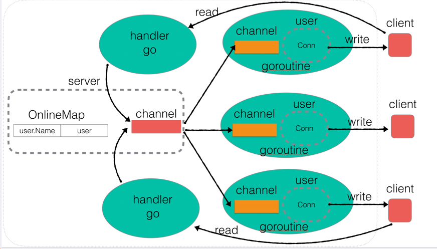
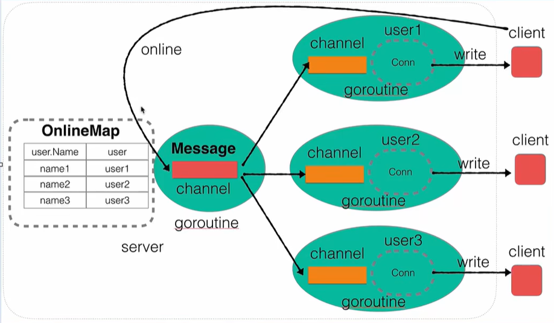

> 参考教程：[B站刘丹冰](https://www.bilibili.com/video/BV1gf4y1r79E/?spm_id_from=333.337.search-card.all.click&vd_source=34da131fa0b4ef9d62e5e0c78828f630)后端转Go教程，最后案例实战部分

[TOC]

## 项目架构图



## 服务端代码实现

### 基础server构建

#### server.go

```go
package main

import (
    "fmt"
    "net"
)

type Server struct {
    Ip   string
    Port int
}

// 创建一个server的接口
func NewServer(ip string, port int) *Server {
    server := &Server{Ip: ip, Port: port}
    return server
}

// 业务处理器handler
func (this *Server) Handler(conn net.Conn) {
    //当前链接的业务
    fmt.Println("链接建立成功")
}

// 启动服务器的接口
func (this *Server) Start() {
    //server listen
    listener, err := net.Listen("tcp", fmt.Sprintf("%s:%d", this.Ip, this.Port))
    if err != nil {
       fmt.Println("net.Listen err: ", err)
       return
    }
    //close listener socket
    defer listener.Close()

    fmt.Println("server listening...")

    for {
       //accept
       conn, err := listener.Accept()
       if err != nil {
          fmt.Println("listener accept err: ", err)
          continue
       }

       //do handler
       go this.Handler(conn)
    }
}
```

#### main.go

```go
package main

func main() {
    server := NewServer("127.0.0.1", 8888)
    server.Start()
}
```

#### 编译运行

编译：

```bash
# Linux
go build -o server main.go server.go

# Windows
go build -o server.exe main.go server.go
```

运行：

```bash
# Linux
./server

# Windows
.\serve.exe
```

新建一个终端进行连接：

```bash
# Linux
nc 127.0.0.1 8888

# Windows
telnet.exe 127.0.0.1 8888
```

### 用户上线及广播功能

#### 思路



**思路：**

在Server中，用一个 Channel （Message）来装需要广播的消息；
当server启动时，我们可以启动一个goroutine去监听Message是否可读，可读就将读取到的msg广播发给所有user的私有channel；
然后在每连接一个新用户时，可以往这个Message中放入一条广播用户上线的消息；


#### user.go

```go
package main

import "net"

type User struct {
    Name string
    Attr string
    C    chan string
    conn net.Conn
}

// 创建一个用户的API
func NewUser(conn net.Conn) *User {
    userAddr := conn.RemoteAddr().String()
    user := User{
       Name: userAddr,
       Attr: userAddr,
       C:    make(chan string),
       conn: conn,
    }

    //启动监听当前user channel 的goroutine
    go user.ListenMessage()

    return &user
}

// 监听当前User channel的 方法,一旦有消息，就直接发送给对端客户端
func (this *User) ListenMessage() {
    for {
       msg := <-this.C
       this.conn.Write([]byte(msg + "\n"))
    }
}
```

#### server.go修改

```go
package main

import (
    "fmt"
    "net"
    "sync"
)

type Server struct {
    Ip   string
    Port int

    //在线用户 map
    OnlineUserMap map[string]*User
    mapLock       sync.RWMutex

    //消息广播的channel
    Message chan string
}

// 创建一个server的接口
func NewServer(ip string, port int) *Server {
    server := &Server{
       Ip:            ip,
       Port:          port,
       OnlineUserMap: make(map[string]*User),
       Message:       make(chan string),
    }
    return server
}

// 监听广播channel Message，一旦其中有消息，就广播给所有用户
func (this *Server) ListenMessager() {
    for {
       msg := <-this.Message

       //将msg发送给所有在线的user
       this.mapLock.Lock()
       for _, cli := range this.OnlineUserMap {
          cli.C <- msg
       }
       this.mapLock.Unlock()
    }
}

// 广播消息的方法
func (this *Server) BroadCast(user *User, msg string) {
    sendMsg := "[" + user.Attr + "]" + user.Name + ": " + msg

    this.Message <- sendMsg
}

// 业务处理器handler
func (this *Server) Handler(conn net.Conn) {
    //当前链接的业务

    user := NewUser(conn)
    //用户上线，将user加入到onlineUserMap
    this.mapLock.Lock()
    this.OnlineUserMap[user.Name] = user
    this.mapLock.Unlock()

    //广播当前用户上线消息
    this.BroadCast(user, "已上线")

    //阻塞当前handler，否则goroutien结束
    select {}

}

// 启动服务器的接口
func (this *Server) Start() {
    //server listen
    listener, err := net.Listen("tcp", fmt.Sprintf("%s:%d", this.Ip, this.Port))
    if err != nil {
       fmt.Println("net.Listen err: ", err)
       return
    }
    //close listener socket
    defer listener.Close()

    //启动监听Message的goroutine
    go this.ListenMessager()

    fmt.Println("server listening...")

    for {
       //accept
       conn, err := listener.Accept()
       if err != nil {
          fmt.Println("listener accept err: ", err)
          continue
       }

       //do handler
       go this.Handler(conn)
    }
}
```

#### 编译运行

编译：

```bash
# Linux
go build -o server main.go server.go user.go

# Windows
go build -o server.exe main.go server.go user.go
```

运行：

```bash
# Linux
./server

# Windows
.\serve.exe
```

新建一个终端进行连接：

```bash
# Linux
nc 127.0.0.1 8888

# Windows
telnet.exe 127.0.0.1 8888
```

### 用户消息广播功能

修改server.go中的 Handler 方法：

```go
// 业务处理器handler
func (this *Server) Handler(conn net.Conn) {
	//当前链接的业务

	user := NewUser(conn)
	//用户上线，将user加入到onlineUserMap
	this.mapLock.Lock()
	this.OnlineUserMap[user.Name] = user
	this.mapLock.Unlock()

	//广播当前用户上线消息
	this.BroadCast(user, "已上线")

	//接收客户端发送的消息
	go func() {
		buf := make([]byte, 4096)
		for {
			n, err := conn.Read(buf)
			// n == 0：代表阻塞读取的正常退出
			if n == 0 {
				this.BroadCast(user, "下线")
				return
			}

			if err != nil && err != io.EOF {
				fmt.Println("Conn Read err: ", err)
				return
			}

			//提取用户消息（去掉'\n'）
			msg := string(buf[:n-1])
			//将消息广播
			this.Message <- msg
		}
	}()

	//阻塞当前handler，否则goroutine结束
	select {}

}
```

### 整理代码：用户业务封装

将原来server.go中的应该属于user的业务代码，封装到user.go中去：

修改server.go的Handler()：

```go
// 业务处理器handler
func (this *Server) Handler(conn net.Conn) {
    //当前链接的业务

    user := NewUser(conn, this)

    //用户上线业务
    user.Online()

    //接收客户端发送的消息
    go func() {
       buf := make([]byte, 4096)
       for {
          n, err := conn.Read(buf)
          // n == 0：代表阻塞读取的正常退出
          if n == 0 {
             //用户下线业务
             user.Offline()
             return
          }

          if err != nil && err != io.EOF {
             fmt.Println("Conn Read err: ", err)
             return
          }

          //提取用户消息（去掉'\n'）
          msg := string(buf[:n-1])
          //将消息广播
          user.DoMessage(msg)
       }
    }()

    //阻塞当前handler，否则goroutine结束
    select {}

}
```

在user.go中新增方法，并新增一个成员变量：

```go
type User struct {
    Name string
    Attr string
    C    chan string
    conn net.Conn

    server *Server
}

// 用户上线业务
func (this *User) Online() {
    //用户上线，将user加入到onlineUserMap
    this.server.mapLock.Lock()
    this.server.OnlineUserMap[this.Name] = this
    this.server.mapLock.Unlock()

    //广播当前用户上线消息
    this.server.BroadCast(this, "已上线")
}

// 用户下线业务
func (this *User) Offline() {
    //用户下线，将user从onlineUserMap删除
    this.server.mapLock.Lock()
    delete(this.server.OnlineUserMap, this.Name)
    this.server.mapLock.Unlock()

    this.server.BroadCast(this, "下线")
}

// 用户处理消息的业务
func (this *User) DoMessage(msg string) {
    this.server.BroadCast(this, msg)
}

// 创建一个用户的API
func NewUser(conn net.Conn, server *Server) *User {
    userAddr := conn.RemoteAddr().String()
    user := User{
       Name:   userAddr,
       Attr:   userAddr,
       C:      make(chan string),
       conn:   conn,
       server: server,
    }

    //启动监听当前user channel 的goroutine
    go user.ListenMessage()

    return &user
}

// 监听当前User channel的 方法,一旦有消息，就直接发送给对端客户端
func (this *User) ListenMessage() {
    for {
       msg := <-this.C
       this.conn.Write([]byte(msg + "\n"))
    }
}
```

### 在线用户查询

修改user.go的DoMessage()方法：

```go
// 用户处理消息的业务
func (this *User) DoMessage(msg string) {
    if msg == "who" { //如果消息是who，则是查询当前在线用户有哪些
       this.server.mapLock.Lock()
       for _, user := range this.server.OnlineUserMap {
          onlineMsg := "[" + user.Attr + "]" + user.Name + ": " + "在线...\n"
          this.SendMsg(onlineMsg)
       }
       this.server.mapLock.Unlock()
    } else {
       this.server.BroadCast(this, msg)
    }
}
```

### 修改用户名

修改user.go的DoMessage()方法：

```go
// 用户处理消息的业务
func (this *User) DoMessage(msg string) {
    if msg == "who" { //如果消息是who，则是查询当前在线用户有哪些
       this.server.mapLock.Lock()
       for _, user := range this.server.OnlineUserMap {
          onlineMsg := "[" + user.Attr + "]" + user.Name + ": " + "在线...\n"
          this.SendMsg(onlineMsg)
       }
       this.server.mapLock.Unlock()
    } else if len(msg) > 6 && msg[:6] == "rename" { //如果是重命名
       newName := strings.TrimSpace(msg[6:])
       _, ok := this.server.OnlineUserMap[newName]
       if ok {
          this.SendMsg("当前用户名已经被使用\n")
       } else {
          this.server.mapLock.Lock()
          delete(this.server.OnlineUserMap, this.Name)
          this.Name = newName
          this.server.OnlineUserMap[newName] = this
          this.SendMsg("用户名已修改为：" + newName + "\n")
          this.server.mapLock.Unlock()
       }
    } else {
       this.server.BroadCast(this, msg)
    }
}
```


### 超时强制下线

修改server.go中的Handler方法：添加了一个局部的channel变量isLive，然后在handler的最后，开启一个for select 判断是否超时，select当所有case都阻塞时，如果没有default，则当某个case可执行时，就会执行这个case然后刷新select：

```go
// 业务处理器handler
func (this *Server) Handler(conn net.Conn) {
    //当前链接的业务

    user := NewUser(conn, this)

    //用户上线业务
    user.Online()

    //监听用户是否活跃的channel
    isLive := make(chan bool)

    //接收客户端发送的消息
    go func() {
       buf := make([]byte, 4096)
       for {
          n, err := conn.Read(buf)
          // n == 0：代表阻塞读取的正常退出
          if n == 0 {
             //用户下线业务
             user.Offline()
             return
          }

          if err != nil && err != io.EOF {
             fmt.Println("Conn Read err: ", err)
             return
          }

          //提取用户消息（去掉'\n'）
          msg := string(buf[:n-1])
          //将消息广播
          user.DoMessage(msg)

          //用户的任意消息，代表当前用户是一个活跃的
          isLive <- true
       }
    }()

    //超时强制下线
    for {
       select {
       case <-isLive:
          //代表当前用户是活跃的，应该重置定时器
          //不做任何事，为了激活select，更新下面的定时器
       case <-time.After(10 * time.Second):
          //已经超时
          //将当前的User强制的关闭
          user.SendMsg("你被踢了\n")
          
          //关闭资源：不能直接调用offLine，否则上面的goroutine还会调用一次offLine
          close(user.C)
          user.conn.Close()
          close(isLive)

          //当前用户下线
          user.Offline()
          return
       }
    }
}
```

### 私聊功能

修改user.go的DoMessage()：

```go
// 用户处理消息的业务
func (this *User) DoMessage(msg string) {
    //去掉前后空格
    msg = strings.TrimSpace(msg)
    if msg == "who" { //如果消息是who，则是查询当前在线用户有哪些
       ...
    } else if len(msg) > 6 && msg[:6] == "rename" { //如果是重命名
       ...
    } else if len(msg) > 2 && msg[:2] == "to" { //如果是to，代表私聊
       //消息格式 to name hello

       //将msg分割为单词数组
       fields := strings.Fields(msg)
       if len(fields) < 3 {
          this.SendMsg("请输入对方用户名")
          return
       }

       //获取对方的用户名
       remoteName := fields[1]
       if strings.TrimSpace(remoteName) == "" {
          this.SendMsg("对方用户名不能为空")
          return
       }

       //在onlineUserMap中获取user对象
       remoteUser, ok := this.server.OnlineUserMap[remoteName]
       if !ok {
          this.SendMsg("该用户不存在")
          return
       }

       //获取消息内容，发送给remoteUser
       var content string
       for _, s := range fields[2:] {
          content += s + " "
       }
       if content == "" {
          this.SendMsg("无消息内容，请重发")
          return
       }
       remoteUser.SendMsg(this.Name + "想对您说：" + content)
    } else {
       this.server.BroadCast(this, msg)
    }
}
```

## 客户端代码实现

### 建立连接

新建client.go：

```go
package main

import (
    "fmt"
    "net"
)

type Client struct {
    Ip   string
    Port int
    Name string
    conn net.Conn
}

func NewClient(serverIp string, serverPort int) *Client {
    //创建客户端对象
    client := &Client{
       Ip:   serverIp,
       Port: serverPort,
    }

    //链接server
    conn, err := net.Dial("tcp", fmt.Sprintf("%s:%d", serverIp, serverPort))
    if err != nil {
       fmt.Println("net.Dial err: ", err)
       return nil
    }

    client.conn = conn
    return client
}

func main() {

    client := NewClient("127.0.0.1", 8888)
    if client == nil {
       fmt.Println(">>>>>>>链接服务器失败...")
       return
    }
    fmt.Println(">>>>>>>>链接服务器成功...")

    //启动客户端的业务
    select {}
}
```

### 命令行解析

添加命令行解析，让客户端可以指定连接的服务端的IP和Port

修改client.go：

```go
var serverIp string
var serverPort int

func init() {
    //命令格式：./client -ip 127.0.0.1 -port 8888
    //查看命令帮助文档：./client -h
    flag.StringVar(&serverIp, "ip", "127.0.0.1", "设置服务器IP地址(默认是127.0.0.1)")
    flag.IntVar(&serverPort, "port", 8888, "设置服务器端口(默认是8888)")
}

func main() {
    //命令行解析
    flag.Parse()

    client := NewClient(serverIp, serverPort)
    if client == nil {
       fmt.Println(">>>>>>>链接服务器失败...")
       return
    }
    fmt.Println(">>>>>>>>链接服务器成功...")

    //启动客户端的业务
    select {}
}
```

### 显示菜单

修改client.go：

```go
func (this *Client) menu() bool {
    var flag int
    fmt.Println("1.公聊模式")
	fmt.Println("2.私聊模式")
	fmt.Println("3.更新用户名")
	fmt.Println("0.退出")

    fmt.Scanln(&flag)
    if flag >= 0 && flag <= 3 {
       this.flag = flag
       return true
    } else {
       fmt.Println(">>>>>请输入合法范围内的数组<<<<<")
       return false
    }
}

func (this *Client) Run() {
    //一直循环到用户输入0退出为止
    for this.flag != 0 {
       //一直循环到输入合法数字为止
       for this.menu() != true {
       }

       switch this.flag {
       case 1:
          //公聊模式
          break
       case 2:
          //私聊模式
          break
       case 3:
          //更新用户名
          break
       }
    }
}

func main() {
    //命令行解析
    flag.Parse()

    client := NewClient(serverIp, serverPort)
    if client == nil {
       fmt.Println(">>>>>>>链接服务器失败...")
       return
    }
    fmt.Println(">>>>>>>>链接服务器成功...")

    defer client.conn.Close()

    //启动客户端的业务
    client.Run()
}
```

### 修改用户名

修改client.go：

```go
func (this *Client) UpdateName() bool {
    fmt.Println(">>>>>>请输入用户名：")
    fmt.Scanln(&this.Name)
    sendMsg := "rename " + this.Name + "\n"
    _, err := this.conn.Write([]byte(sendMsg))
    if err != nil {
       fmt.Println("conn.Write err: ", err)
       return false
    }
    return true
}

// 处理server回应的消息，直接显示到标准输出即可
func (this *Client) DealResponse() {
    //一旦client.conn有数据，就直接copy到stdout的标准输出上，永久阻塞监听
    io.Copy(os.Stdout, this.conn)

    //等价于下面几句：
    //for {
    // buf := make([]byte, 4096)
    // n, err := this.conn.Read(buf)
    // fmt.Println(string(buf[:n-1]))
    //}
}

func (this *Client) Run() {
    //一直循环到用户输入0退出为止
    for this.flag != 0 {
       //一直循环到输入合法数字为止
       for this.menu() != true {
       }

       switch this.flag {
       case 1:
          //公聊模式
          break
       case 2:
          //私聊模式
          break
       case 3:
          //更新用户名
          this.UpdateName()
          break
       }
    }
}

func main() {
    //命令行解析
    flag.Parse()

    client := NewClient(serverIp, serverPort)
    if client == nil {
       fmt.Println(">>>>>>>链接服务器失败...")
       return
    }
    fmt.Println(">>>>>>>>链接服务器成功...")

    defer client.conn.Close()

    //单独一个goroutine处理server的回执消息
    go client.DealResponse()

    //启动客户端的业务
    client.Run()
}
```

### 公聊模式

修改client.go：并在Run()方法的公聊分支中调用

```go
// 公聊模式
func (this *Client) PublicChat() {
    var chatMsg string
    fmt.Println(">>>>>请输入聊天内容，exit退出.")
    fmt.Scanln(&chatMsg)

    for chatMsg != "exit" {
       fmt.Println("您输入的是：", chatMsg)
       if len(chatMsg) != 0 {
          sendMsg := chatMsg + "\n"
          _, err := this.conn.Write([]byte(sendMsg))
          if err != nil {
             fmt.Println("conn write error: ", err)
             break
          }
       }

       //置空消息，开始下一轮循环
       chatMsg = ""
       fmt.Println(">>>>>请输入聊天内容，exit退出.")
       fmt.Scanln(&chatMsg)
    }
}
```

### 私聊模式

修改client.go：并在Run()方法的私聊分支中调用

```go
func (this *Client) SelectUsers() {
    sendMsg := "who\n"
    this.conn.Write([]byte(sendMsg))
}

func (this *Client) PrivateChat() {
    var remoteUser string
    var chatMsg string

    this.SelectUsers()
    fmt.Println(">>>>>请输入您想私聊的对象，exit退出：")
    fmt.Scanln(&remoteUser)

    for remoteUser != "exit" {
       fmt.Println(">>>>>请输入聊天内容，exit退出：")
       fmt.Scanln(&chatMsg)
       for chatMsg != "exit" {
          if len(chatMsg) != 0 {
             sendMsg := "to " + remoteUser + " " + chatMsg + "\n\n"
             _, err := this.conn.Write([]byte(sendMsg))
             if err != nil {
                fmt.Println("conn write error: ", err)
                break
             }
          }

          //置空消息，开始下一轮循环
          chatMsg = ""
          fmt.Println(">>>>>请输入聊天内容，exit退出.")
          fmt.Scanln(&chatMsg)
       }

       remoteUser = ""
       this.SelectUsers()
       fmt.Println(">>>>>请输入您想私聊的对象，exit退出：")
       fmt.Scanln(&remoteUser)
    }
}
```


